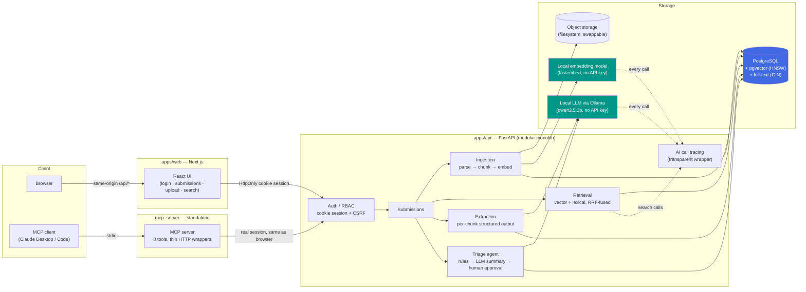

# Enterprise Agent Platform

**A production-oriented, agentic AI platform for evidence-grounded, high-consequence document workflows.**
Fictional use case: commercial insurance underwriting document intelligence — every AI finding traces back to a source document, page, and chunk.

[](https://github.com/ngcd04-fa07/enterprise-agent-platform/actions/workflows/ci.yml)


---

## Why this exists

Most AI demo projects stop at "call the model and print the answer." This one is built to demonstrate the engineering that has to exist *around* the model in a real product: multi-tenant data isolation, provenance-backed retrieval, typed and validated tool calls, a real Postgres schema with migrations, and a CI pipeline that's actually been made to fail and then fixed — not just written and assumed to work.

It's built as a staged, reviewable roadmap (Stage 0 → Stage 21), currently through **Stage 18 of 21** — auth/RBAC through a working end-to-end retrieval UI, hardened with CI and a full-journey integration test, schema-validated structured extraction from a local LLM, hybrid (semantic + lexical) search backed by a real benchmark, a first agentic workflow (automated underwriting triage with deterministic rules, an auditable pipeline, and mandatory human approval), an MCP server exposing all of it as typed tools with zero new trust decisions, AI call tracing (every LLM/embedding/retrieval call, latency and error rate), an evaluation harness — deterministic scoring for extraction accuracy, LLM-as-judge (with a versioned prompt) for the one genuinely semantic dimension in the app — complexity-based model routing between two local LLMs (Stage 16), a CI-integrated eval smoke test that guards the harness itself against regressions on every push (Stage 17), and systematic release comparison (persisted baseline-vs-candidate runs, aggregate *and* slice-level regression detection, a CLI report — Stage 18, complete). Remaining: Stage 19 hardens and generalises Stage 16's existing routing layer for production use (richer fallback policy, cost/latency-aware selection — not a new routing mechanism from scratch), Stage 20 is a security and production-readiness hardening pass, and Stage 21 is deployment (S3-compatible storage, multi-replica-safe migrations) and final polish.

## Table of contents

- [Architecture](#architecture)
- [Engineering highlights](#engineering-highlights)
- [Capabilities](#capabilities)
- [Tech stack](#tech-stack)
- [Quick start](#quick-start)
- [Repository layout](#repository-layout)
- [Verification & testing](#verification--testing)
- [Documentation](#documentation)
- [Limitations](#limitations)

## Architecture



Every arrow into Postgres carries `organisation_id` scoping enforced at the **repository layer**, not just the route — cross-tenant access fails even against a correctly-guessed UUID. See [Engineering highlights](#engineering-highlights).

## Engineering highlights

What this project is actually meant to demonstrate, beyond "it works":

- **Tenant isolation enforced in SQL, not in the UI.** Every query touching submissions, documents, pages, or chunks filters `organisation_id` inside the `WHERE` clause — including both halves of the hybrid search (pgvector similarity and Postgres full-text). Backed by explicit cross-tenant-denial tests, not just code review.
- **Provenance is structural, not cosmetic.** Every chunk carries `document_id` / `page_id` / `submission_id` / `organisation_id`; every search result can be traced back to an exact page.
- **Security-conscious auth by default.** Argon2id password hashing, HMAC-hashed session tokens (never stored raw), `HttpOnly` cookies, double-submit CSRF on every state-changing route, server-derived organisation/role on every request — no client-supplied `organisation_id` or `role` is ever trusted.
- **Deterministic-first.** Chunking, validation, and provenance are plain code, not LLM calls. Extraction provenance is never *asked* of the model — each field is extracted one chunk at a time, so the source chunk is always the one actually being read. The triage agent goes further: it's a fixed pipeline, not a model-driven tool-selection loop, and the actual `approve`/`refer` recommendation is always computed by plain-code rules — the model only narrates already-decided findings, and can't overrule them even if it tried.
- **Consequential actions stay human-gated.** The triage agent's recommendation never auto-applies to a submission's status; every run requires an explicit, audited approval action, and there's no "decline" the agent can produce at all in this first version — only a human, through the ordinary submission-update path, makes that call.
- **Verification over vibes.** Every stage has been checked against a *real* Postgres instance, a *real* embedding model, and a *real* local LLM — not just a green test suite. This discipline has caught seven real, reproducible bugs invisible to `mypy`/`ruff`/a passing local test run, plus honest reporting of real model-reliability limits (a 3B local model correctly extracted 3 of 5 target fields from a test submission, with zero hallucinated values, both in extraction and in the triage agent built on top of it). Full writeups in [`docs/architecture.md`](docs/architecture.md).
- **No hidden provider coupling.** LLM and embedding calls are abstracted behind a gateway interface — swapping providers touches one file, not business logic.
- **New surfaces don't get new trust decisions.** The MCP server (Stage 13) is a thin proxy over the real HTTP API, authenticated with a real session from the real login flow — an MCP client can never do anything that session's role couldn't already do in the browser. Tenant isolation and RBAC are inherited, not reimplemented.
- **Every AI call is traced without being asked to be.** LLM and embedding calls are traced by wrapping the provider interfaces once, at the factory — every feature that already depends on those interfaces gets latency/status/error tracking for free, with zero code changes anywhere else.
- **The evaluator matches the question.** Extraction accuracy is scored by exact string comparison, not an LLM — "does the text contain $500,000" isn't a judgment call. LLM-as-judge is reserved for the one question that actually needs it (is this summary faithful to its input), with a versioned prompt and a structured verdict — and the judge's own limitations are reported honestly, including a real case where it flagged an issue yet still returned "faithful."
- **Routing is on a declared signal, never an inferred one.** Callers pass an explicit `TaskComplexity` hint — extraction stays on the fast local model by default (per-chunk cost/latency), while triage synthesis and eval judging request the capable tier, because that's exactly where Stage 12/15 found the small model's reasoning (not recall) was weakest. A fast-tier failure escalates once to the capable tier automatically, proven live by forcing a real failure rather than only unit-testing it.
- **An aggregate improvement can never hide a slice-level regression.** Every release comparison checks aggregate *and* every slice completely independently — an overall metric can look better while a specific slice quietly gets worse, and the comparison engine is built to catch exactly that, not to average it away. Metric direction (higher- vs. lower-is-better) is an explicit, finite registry, not a guess — an unregistered metric is flagged as such rather than silently assumed to be "higher is better."

## Capabilities

Only checked once actually implemented **and verified** in this repo — see [Verification & testing](#verification--testing).

| | Capability |
|---|---|
| ✅ | Multi-tenant architecture (org-scoped, enforced server-side) |
| ✅ | RBAC (admin / underwriter / reviewer / viewer) |
| ✅ | Document ingestion (PDF → pages → chunks, with provenance) |
| ✅ | Vector search (pgvector, HNSW, real semantic-not-exact-match verified) |
| ✅ | End-to-end frontend (register, login, submissions, upload, search) |
| ✅ | CI/CD (lint, types, tests, eval harness smoke test, Docker build & boot, on every push) |
| ✅ | Structured extraction (local open-source LLM, per-chunk, deterministic provenance) |
| ✅ | Hybrid (lexical + vector) retrieval, RRF-fused |
| ✅ | Retrieval benchmark (Recall@k / MRR, vector vs. lexical vs. hybrid) |
| ✅ | Agentic underwriting workflow (rules-driven triage, auditable pipeline) |
| ✅ | Human approval / review queue (mandatory on every agent run) |
| ✅ | MCP integrations (server exposing search/extraction/triage as tools) |
| ✅ | Permission-aware tool calling (MCP tools inherit real session RBAC) |
| ✅ | AI tracing / observability (every LLM/embedding/retrieval call, latency, error rate) |
| ✅ | Automated evaluation harness (deterministic extraction accuracy + LLM-as-judge faithfulness) |
| ✅ | Model routing (complexity-based, two local models, failure escalation) |
| ✅ | Release comparison (persisted baseline vs. candidate, aggregate + slice-level regression detection) |
| ⬜ | Evidence-level citations in the UI |

## Tech stack

| Layer | Choice | Why |
|---|---|---|
| Backend | FastAPI, Pydantic v2, SQLAlchemy 2.x (async) | Typed end-to-end, async-native, no framework magic hiding the SQL |
| Database | PostgreSQL + pgvector (HNSW, cosine) + full-text (GIN) | One source of truth for relational, vector, *and* lexical search — no separate search engine to keep in sync |
| Embeddings | `fastembed` (local ONNX, `bge-small-en-v1.5`) | Real semantic search with zero API key / external dependency |
| LLM (structured extraction, triage, eval judging) | Ollama, `qwen2.5:3b` + `qwen2.5:14b` (local, open-source, complexity-routed) | Real schema-validated generation with zero API key / per-call cost |
| Auth | Argon2id + HMAC-hashed cookie sessions + CSRF | No JWT-in-localStorage XSS surface; server-side revocation |
| Frontend | Next.js 15 (App Router) + TypeScript | Same-origin API proxy keeps the session cookie first-party |
| Migrations | Alembic (async), autogenerate-diff-verified | Every migration checked to produce an empty diff against the models |
| CI/CD | GitHub Actions | Lint, types, tests against real Postgres, full Docker Compose boot — every push |
| Tool integration | MCP (`mcp` Python SDK), stdio transport | Standard protocol for exposing tools to any MCP client, not a bespoke API-key scheme |

## Quick start

Requires Docker and Docker Compose. (Backend can also run standalone with Python 3.12+; frontend standalone with Node 22+.) Structured extraction additionally needs [Ollama](https://ollama.com) running locally (`ollama serve`) with both models pulled (`ollama pull qwen2.5:3b && ollama pull qwen2.5:14b`) — everything else works without it; extraction/triage just return a clean `"failed"` status until they're available. See `.env.example` for `OLLAMA_BASE_URL`/`OLLAMA_MODEL`/`OLLAMA_CAPABLE_MODEL`.

```bash
git clone https://github.com/ngcd04-fa07/enterprise-agent-platform.git
cd enterprise-agent-platform
cp .env.example .env   # fill in SESSION_SECRET and Postgres credentials
docker compose up --build
```

- API: [http://localhost:8000/health](http://localhost:8000/health)
- Web: [http://localhost:3000](http://localhost:3000)

<details>
<summary><strong>Backend only</strong></summary>

```bash
cd apps/api
python3 -m venv .venv && source .venv/bin/activate
pip install -e ".[dev]"
ruff check .
mypy app
pytest
```

</details>

<details>
<summary><strong>Frontend only</strong></summary>

```bash
cd apps/web
npm install
npm run lint
npm run typecheck
npm run build
```

</details>

## Repository layout

```
apps/api/     FastAPI backend — routes → services → repositories → models
apps/web/     Next.js (App Router, TypeScript) frontend
benchmarks/   Retrieval quality benchmark (Recall@k / MRR), runs against apps/api's own code
evals/        Extraction accuracy (deterministic) + triage summary faithfulness (LLM-as-judge)
mcp_server/   MCP server exposing the API as tools — a thin HTTP proxy, its own minimal venv
docs/         Architecture decisions, rationale, verification log
.github/      CI workflows
docker-compose.yml
```

## Verification & testing

**Status:** Stage 18 (Regression testing / release comparison) — done. 110 backend tests plus 13 pure eval-comparison tests plus 7 MCP-server tests pass, and CI now also runs an eval harness smoke test (including a comparison check) on every push, alongside building and booting the full Docker Compose stack ([latest green run](https://github.com/ngcd04-fa07/enterprise-agent-platform/actions/workflows/ci.yml)). The full user journey (register → submission → upload → parse → chunk → embed → hybrid search → extract → triage → approve → logout) has been walked both by automated tests and live against real models — including, in Stage 16, a forced fast-tier model failure that live-proved automatic escalation to the capable tier. Stage 8 also passed a release-candidate audit of Stages 1-8 before Stage 9 began; see [`docs/architecture.md`](docs/architecture.md) for the full writeup.

<details>
<summary><strong>Full verification log — what was actually run, and eight real bugs it caught</strong></summary>

- Backend: `ruff`, `ruff format --check`, `mypy --strict`, and `pytest` all pass.
- Frontend: `npm run lint`, `npm run typecheck`, and `npm run build` all pass.
- Full Docker Compose stack: `docker compose up --build` brings up Postgres (healthy), the API, and the web app end to end.
- All eight Alembic migrations apply cleanly against real Postgres, and `alembic revision --autogenerate` afterward produces an empty diff every time — proof the hand-written migrations exactly match the SQLAlchemy models.
- All 110 backend tests pass against real Postgres, including cross-tenant-denial tests at both the HTTP layer and the repository layer (two real organisations' data present simultaneously, proving the SQL filter itself — not just an earlier ownership check), an RBAC test proving a viewer role is rejected from write endpoints, document upload/download validation tests, PDF ingestion tests (per-page extraction, chunk provenance, graceful failure on an unparseable PDF, atomicity on partial failure), search bounding/validation tests, extraction tests (merge-order/provenance proof, failed-run field preservation) against both a fake and the real Ollama model, a deterministic hybrid-retrieval test that hand-constructs embeddings so a lexically-relevant chunk is the *worst* possible vector match, pure unit tests for the deterministic triage rules, agent-run tests covering recommendation logic, RBAC-gated approval, tenant isolation, and clean failure handling, AI-tracing tests proving both the LLM/embedding wrappers and retrieval's own trace commit independently and are queryable afterward, and routing tests covering complexity-based tier selection plus fast-tier-failure escalation (and the case where both tiers fail).
- Live routing verification against real Postgres and two real Ollama models: the extraction call traced to `qwen2.5:3b` with `complexity: simple`, the triage call traced to `qwen2.5:14b` with `complexity: complex` — confirmed directly via `ai_call_traces`. Separately, misconfigured the fast tier to a nonexistent model to force a real failure (an actual 404 from Ollama): the request still succeeded via automatic escalation, visible as a failed fast-tier trace immediately followed by a successful capable-tier trace for the same call, plus the expected warning log line. Both Stage 15 evaluators were re-run under the new routing: extraction unchanged (100% precision / 80% recall, still fast-tier), and the faithfulness judge — now capable-tier — scored 4/4 faithful with clean, self-consistent reasoning on every scenario, with no repeat of Stage 15's documented run-to-run inconsistency.
- A live Docker Compose **hybrid search** check against the real embedding model — the strongest single proof point for retrieval: querying an exact policy number (`"ABC-99182-XY"`) correctly ranked the page containing it first (a lexical win — embedding models have little reason to weight an arbitrary alphanumeric code); querying a paraphrase with no literal word overlap (`"quarterly earnings increased"` vs. stored text `"revenue grew ... sales performance"`) still correctly ranked the revenue page first (a genuine semantic win, not keyword luck).
- A live end-to-end **structured extraction** check against the real local LLM (not the fake): a realistic 2-page underwriting submission correctly yielded 3 of 5 target fields — broker name, business description, coverage limit — each verbatim and citing the exact correct source page, with zero hallucinated values, confirmed via `GET /submissions/{id}/extraction` and direct `psql` inspection of the persisted rows.
- A real **retrieval benchmark** run (`benchmarks/retrieval/`, real Postgres + real embedding model, 12 hand-labeled queries): vector-only scored Recall@5 = 1.000 / MRR = 0.840, lexical-only 0.333 / 0.333 (only hitting where literal vocabulary actually overlapped — several queries share zero words with their relevant chunk), hybrid tied vector exactly. Reported honestly rather than reframed as a bigger win: RRF's floor is "as good as the better individual signal," and this benchmark's real, demonstrated value is the exact-identifier case already shown live above, not average-case superiority over a strong embedding model. The benchmark seeds its fixtures inside a transaction it always rolls back — verified via direct `psql` inspection to leave zero rows behind.
- A live end-to-end **agentic triage** run against the real local LLM: uploaded a realistic submission, extracted 3 of 5 fields, then ran triage — correctly flagged the two missing fields (high/low severity), correctly recommended "refer" from plain-code rules alone, and the model's narrative summary accurately restated exactly the given facts without inventing anything or overriding the given recommendation. Approved the run as admin (`approved_by_user_id`/`approved_at` confirmed via `psql`); a second organisation was denied `404` on both reading and approving it. Through the full Docker Compose stack (Ollama unreachable from inside the container, same constraint as extraction), the endpoint still returned a clean `201` with `status: "failed"` — no crash, no impact on any other route.
- A live **MCP server** check using the real `mcp` Python client library (not a mock): a real login, then every one of the 8 tools called for real against a running API — including `trigger_triage` running a real triage pass and `approve_agent_run` confirmed via `psql`. Also verified the failure path deliberately: an MCP call for a nonexistent submission correctly surfaced as a clean tool-level error (`is_error: true`), not a crash. A second organisation's MCP session saw an empty submission list and the same clean error trying to reach the first organisation's data by id — tenant isolation inherited automatically from the underlying API, with no MCP-specific isolation code to get wrong.
- A live **AI call tracing** check: ran a full journey (register → upload → search → extract → triage) against real models, then confirmed via both `psql` and `scripts/ai_traces_report.py` that every single AI call was traced with the correct type/provider/model/latency and a 0% error rate — one `embed_documents`, one `embed_query`, one `retrieval_search`, two `llm_generate`. Then, through the full Docker Compose stack (Ollama unreachable from inside the container), triggered a real triage failure and confirmed it was traced as a failure with the full error message and a correctly-computed 100% error rate for that call type — both via `psql` and the report script.
- A real **evaluation harness** run (`evals/`, real Postgres + real Ollama, no fakes): the deterministic extraction evaluator scored 100% precision / 80% recall across 4 hand-labeled cases — zero hallucinations, 2 missed fields, matching Stage 9's one-off observation but now as a repeatable measurement. The LLM-as-judge faithfulness evaluator scored all 4 triage scenarios "faithful" — its *reasoning quality* has varied across runs and across the Stage 16 routing change (from the original 3B model to the capable 14B tier), reported plainly in `evals/README.md` rather than smoothed over — a small local judge is a real signal for gross failures, not a stable substitute for reading its reasoning.
- A real **eval harness smoke test** (`evals/smoke_test.py`, Stage 17, now a CI step on every push): drives the exact same harness code as the real evaluators above against a deterministic fake model, and asserts a perfect score — proving the harness's own wiring (dataset loading, fixture seeding, scoring/judging), not model quality. Confirmed it's a real tripwire, not a rubber stamp, by temporarily breaking the extraction scoring function and watching the smoke test fail loudly (then reverting and confirming it passed again). Also caught a real bug before it ever ran in CI: `pytest`'s fixture drops every table at teardown, so the smoke test step has to run right after migrations and *before* `pytest`, not after — verified by reproducing the exact CI step order locally (migrate → smoke test → pytest, all green).
- A real **release-comparison** run (`evals/`, Stage 18): recorded a real `baseline` (extraction on `qwen2.5:3b`) and a real `candidate` (extraction on `qwen2.5:14b`, bypassing routing entirely via `--model`) against the same 4-case dataset, then compared them — the larger model scored *worse* in this one run (90%→85% aggregate, 80%→60% on the `multi_page` slice), persisted and reported factually rather than discarded as inconvenient. This is a single manual run on a 4-case dataset, not a general claim that either model is superior or inferior at extraction — the same honesty standard applied to every other small-sample result in this document. Separately, live-verified every explicit correctness requirement against real Postgres: a duplicate case key within one run was rejected by a DB constraint; recording two runs under the same label and comparing by that label produced the expected disambiguation note (most-recent-wins); comparing an extraction run against a triage run was rejected with a clear error; deleting a run still referenced by a comparison was blocked, while deleting an unreferenced run correctly cascade-deleted its case results. Migrations verified both from zero and incrementally from the Stage 17 head, autogenerate diff-check empty both times. The 13 pure regression-logic tests (`evals/test_comparison.py`, run via `pytest evals/`, zero DB dependency) encode the brief's exact required example: an aggregate improvement (89%→92%) must not mask a slice-level regression (87%→71%) — verified to actually produce an overall REGRESSED verdict, not just assumed to.
- A live two-organisation attack test against the running Docker Compose stack (not the test suite): a real second organisation's session, holding real UUIDs from the first, was denied on every read/write path tried (submissions, documents, pages, content, search) — all `404`, no existence leak — while a search for the first org's exact text run inside the second org's own submission returned zero results.
- Manual checks confirm the session cookie is `HttpOnly`, CSRF is enforced in both directions, and the raw session token never appears in a response body or log — only its HMAC lives in the database.
- A live Docker Compose durability check — upload, download, restart the API container, download again — confirmed uploaded documents persist on the storage volume, not just in-process memory.
- A full real-browser walkthrough against the Docker Compose stack: register → create a submission → upload a real PDF → status reaches "ready" with no manual refresh → a semantic, non-exact-match search returns correctly-ranked results with page number and score → log out → redirected to `/login` → direct navigation to a protected route while logged out redirects, no stale data.

**Real bugs caught by insisting on a real database, a real browser, and a release-candidate audit instead of trusting a green test suite:**

1. A SQLAlchemy `Enum` column persisting `.name` instead of `.value`.
2. An expired `updated_at` after an `UPDATE` crashing every document upload (`MissingGreenlet`).
3. A hand-created pgvector HNSW index that existed in the migration but not the SQLAlchemy model — autogenerate's own drift-check would have proposed dropping it.
4. Next.js baking its `rewrites()` proxy destination into the build output at *build* time, so the Docker build needed `API_ORIGIN` passed as a build arg, not just a runtime env var.
5. CI's Postgres service never had migrations applied, so the `vector` extension didn't exist and every chunk-related test had been silently erroring in CI since Stage 6 — invisible locally because every manual verification ran against a Postgres that already had migrations applied.
6. A failed document ingestion could leave partially-persisted `DocumentPage`/`DocumentChunk` rows committed alongside the `failed` status — reproduced directly, fixed with a SAVEPOINT around the parse/chunk/embed block.
7. A file could be orphaned on disk if the database row failed to persist after a successful storage write — reproduced directly (forced an FK violation), fixed with a compensating delete.
8. `FakeLLMGateway` (test infrastructure) didn't wrap a schema-validation failure into `LLMGenerationError` the way the real `OllamaGateway` does — latent since extraction's schema has no required fields, only surfacing once the triage agent's summary schema needed the same fallback path. Fixed to match the interface's actual contract before it could mask a real failure-handling bug elsewhere.

Full writeups of all eight: [`docs/architecture.md`](docs/architecture.md).

</details>

## Documentation

- [`CLAUDE.md`](CLAUDE.md) — the durable engineering constitution (architecture principles, security rules, workflow discipline) this repo is built under.
- [`docs/architecture.md`](docs/architecture.md) — decision log, roadmap status table, and every bug found in verification, with root cause and fix.

## Limitations

This is Stage 18 of an intentionally staged 21-stage build. No reranking exists yet, and model routing is on a caller-declared complexity hint rather than an inferred or learned signal — see the roadmap table in [`docs/architecture.md`](docs/architecture.md). Both local models run on the same machine: `qwen2.5:14b` is a ~9GB pull with materially higher latency than the 3B tier (the live triage call took ~18s), a real disk/latency cost accepted for better reasoning quality on the calls that need it, not a free upgrade — and, per Stage 18's own real finding, not a guaranteed accuracy upgrade either. The retrieval benchmark's 12 hand-labeled queries, the extraction eval's 4 cases, and the faithfulness eval's 4 scenarios are all small, self-authored samples, not large or adversarial evaluation sets — they're real, honest measurement tools, not a claim that these specific numbers generalize; hybrid retrieval's Reciprocal Rank Fusion constant (`k=60`, the standard default) was deliberately left untuned against it for that reason. The faithfulness evaluator judges with a local model from the same family it's judging — since Stage 16, both the triage synthesis call and the judge's own call route to the same capable `qwen2.5:14b` tier, not two genuinely independent models — a real limitation reported in `evals/README.md`, not hidden: reasoning quality has varied noticeably across runs and across that routing change. The eval harness's own CI smoke test (Stage 17) and the CI-safe comparison check (Stage 18) both check that the harness code is wired correctly against a fake model; neither can or does claim anything about real model quality, which still requires the manual, real-Ollama evaluator/comparison runs. Release comparison itself has a narrow, honestly-scoped surface: only two of the five dimensions named in the roadmap brief (model, and — via the same mechanism — prompt) have a second real option to compare against today; chunking strategy and agent-workflow version have exactly one implementation each, so `run_config` can record a version label for them but there's nothing yet to compare it *against*; retrieval-strategy comparison (Stage 11's vector/lexical/hybrid) was deliberately deferred rather than folded in, since `benchmarks/retrieval/run.py` isn't structured to return data the same way and refactoring it was a bigger lift than this stage's core ask. Structured extraction targets a small, fixed set of fields (not open-ended extraction), runs synchronously per request (same tradeoff as document ingestion), and — being a local 3B-parameter model rather than a frontier one — correctly leaves a field null more often than a hosted model would, at the benefit of never fabricating a value. The triage agent is a fixed pipeline with a first, deliberately simple rule set (four checks), always recommends "approve" or "refer" and never "decline," and always requires human approval with no automatic effect on `Submission.status` — a conservative first version by design, not a placeholder awaiting a missing piece. Ollama isn't containerized in Docker Compose (see the LLM provider decision in `docs/architecture.md`), so extraction and triage only work end-to-end via the native (non-Docker) dev flow unless you separately point `OLLAMA_BASE_URL` at a reachable instance. The MCP server requires a manually-obtained session token (`mcp_server/login.py`) rather than a first-class OAuth flow — a reasonable scope boundary for a local dev tool, not something a multi-user production MCP deployment would use as-is. AI call traces and evaluation comparisons both have no HTTP-exposed viewer yet (direct `psql`/CLI reports only) — a deliberate boundary, since exposing either through the tenant-facing API would need a cross-organisation "platform operator" role this app's RBAC model doesn't have.
