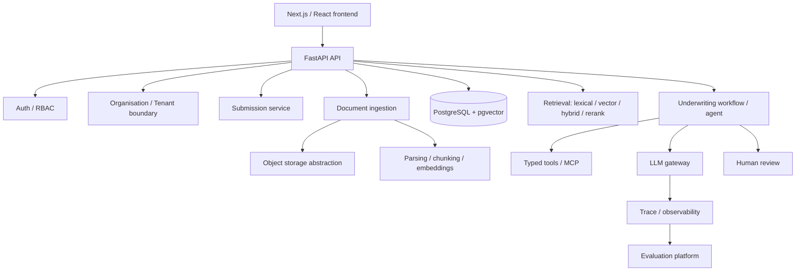

# Architecture

Status labels used throughout this document and the README: **Implemented**,
**In progress**, **Planned**. Nothing below is marked Implemented until code
exists and has been run.

## System overview (target — Planned)

This is a **modular monolith**: one FastAPI application with clearly bounded
internal modules (`api/auth/core/db/models/schemas/repositories/services/
ingestion/retrieval/agents/tools/llm/evals/observability`), not separate
deployable services. Reconsider only if a concrete scaling or team boundary
forces it — not before.

---

## Decision: Repository layout

**Context.** Need a structure that scales through ~20 roadmap stages without
forcing premature service splits or empty placeholder packages.

**Options considered.**
- Single flat FastAPI app, no monorepo packages.
- Monorepo with `apps/api`, `apps/web`, and shared `packages/*`.
- Full microservices split per domain.

**Decision.** Monorepo: `apps/api` (FastAPI), `apps/web` (Next.js),
`packages/*` created only when a package has real shared consumers (e.g.
`agent_core`, `retrieval`, `llm_gateway` once both the API and eval/benchmark
tooling need to import them). `benchmarks/`, `infra/`, `docs/` at the root.

**Why.** Matches the target directory layout in the project brief, keeps
backend/frontend independently testable/deployable, and avoids microservice
operational overhead this project doesn't need.

**Consequences.** `packages/*` will start mostly empty and fill in from
Stage 9 onward (structured extraction) and Stage 11 (retrieval benchmark) —
we will not scaffold empty packages ahead of a real consumer.

---

## Decision: Authentication approach

**Context.** Need to choose between HTTP-only cookie sessions, stateless
JWT, or an external auth provider (Auth0/Clerk/etc.), evaluated against this
project's actual deployment topology, not FastAPI defaults.

**Options considered.**

| Option | CSRF | XSS exposure | Revocation | Local dev | Operational complexity |
|---|---|---|---|---|---|
| Server-side sessions, HTTP-only cookie | Needs same-site/CSRF token | Low (token never in JS) | Immediate (delete session row) | Simple | Low |
| Stateless JWT (Authorization header) | Not applicable | Higher if stored in localStorage; lower via memory-only | Hard without a revocation list (defeats "stateless" benefit) | Simple | Low, but revocation adds a store anyway |
| External auth provider (Auth0/Clerk) | Handled by provider | Depends on integration | Provider-managed | Extra service dependency | Higher; another vendor to configure/demo |

**Decision.** Server-side sessions via HTTP-only, `Secure`, `SameSite=Lax`
cookies, backed by a `sessions` table in PostgreSQL (session id, user id,
issued/expires, revoked flag). CSRF protection via a double-submit token on
state-changing requests.

**Why.** Confirmed deployment topology: frontend and API are served under
the same origin (Next.js rewrites / shared reverse proxy in prod, same-origin
in local dev). Under same-origin, cookie sessions are the simplest option
that is secure by construction — no token ever touches JavaScript (mitigates
XSS token theft), revocation is a single-row update (unlike JWT, which needs
its own denylist to revoke — at which point it isn't meaningfully simpler
than sessions), and `SameSite=Lax` + a CSRF token on mutating requests fully
covers CSRF for this topology without cross-origin CORS complexity. An
external provider is not justified: it adds a vendor dependency and setup
friction for a portfolio project without solving a problem session auth
doesn't already solve here.

If a genuinely separate-origin deployment is introduced later (e.g. a
separately hosted marketing site), this decision should be revisited — that
is a materially different threat/ops profile and is explicitly out of scope
until it's real.

**Consequences.** Authentication (who you are) is implemented via session
cookie + `sessions` table. Authorization (what you can do) is a fully
separate server-side check (RBAC + tenant scoping) evaluated on every
request — a valid session never implies access to a given resource.

---

## Decision: Object storage abstraction

**Context.** Need to store original uploaded documents (PDFs, spreadsheets)
separately from relational metadata, without coupling ingestion code to one
cloud SDK.

**Decision (interface only at this stage).** A small `ObjectStorage`
interface — `put_object`, `get_object`, `delete_object`,
`generate_access_url` — with a filesystem-backed implementation for local
dev and an S3-compatible implementation for deployment. Concrete
implementation lands in Stage 4 (Upload/storage), not now.

**Why.** Keeps ingestion/service code storage-agnostic; swapping filesystem
for S3-compatible storage should only touch the implementation, never
callers. Avoids introducing MinIO/AWS SDK dependencies before there's a real
upload path to exercise them.

---

## Decision: Multi-tenant isolation strategy

**Context.** Cross-tenant data leakage is the single highest-severity risk
class in this system (documents may contain sensitive financial data).

**Decision.** Application-layer enforcement first: every repository method
that reads/writes tenant-owned rows requires an `organisation_id` derived
from the authenticated session's active membership — never from a request
body/query param. Service layer never accepts a bare resource ID without
also checking it resolves within the caller's organisation. Row-Level
Security (RLS) in PostgreSQL is a **candidate defense-in-depth layer**,
deferred until the application-layer boundary is implemented and tested
(explicitly flagged in the brief as "evaluate later, don't introduce
automatically").

**Why.** Application-layer checks are necessary regardless of RLS (RLS
alone doesn't stop business-logic bugs like leaking a cross-tenant ID in an
API response), and are simpler to write tests against first. RLS adds real
value as a second layer but also adds operational complexity (session
variables per connection, policy maintenance) that isn't justified until the
first layer is proven and there's a concrete incident class it would catch
that tests aren't already catching.

**Consequences.** Every new tenant-owned model/endpoint must ship with at
least one cross-tenant-denial test before being considered done (see
`CLAUDE.md` security rules).

---

## Decision: Background job execution

**Status.** Deferred — not decided yet. Per the brief, Celery/Redis must not
be introduced by default. When document ingestion or agent runs first need
to outlive a single HTTP request (Stage 5 onward), this section will compare
FastAPI `BackgroundTasks`, a DB-backed job table/worker, and Redis/RQ against
actual reliability/durability requirements at that point, and record the
decision here.

---

## Decision: Stage 2 API surface — repositories/services now, HTTP endpoints deferred

**Context.** The roadmap lists "CRUD" under Stage 2 (core domain) but auth
under Stage 3. `CLAUDE.md` forbids trusting a client-supplied
`organisation_id`; tenant context must come from an authenticated session's
membership, which doesn't exist until Stage 3 wires up auth.

**Decision.** Stage 2 delivers models, an Alembic migration, and a fully
tested repository/service layer (`OrganisationService`,
`SubmissionService`, plus repositories for `Organisation`, `User`,
`OrganisationMembership`, `Submission`, `Document`). No HTTP endpoints are
exposed yet. `SubmissionRepository`/`SubmissionService` require
`organisation_id` as an explicit parameter on every read/write and return
the same "not found" outcome whether a submission doesn't exist or belongs
to a different organisation — this is exercised directly by
`test_tenant_isolation.py` at the service layer.

**Why.** Building a real HTTP CRUD API now would mean either accepting
`organisation_id` from the client (a security violation) or building a
throwaway auth shim that Stage 3 immediately replaces (a half-finished
implementation). Testing the isolation boundary at the service layer first
means Stage 3's auth work sits on top of a layer that already can't leak
across tenants, rather than being the only thing standing between a bug and
a data leak.

**Consequences.** Stage 3 exposes `POST/GET /submissions` etc. by wrapping
these services with a dependency that derives `organisation_id` from the
session — no new business logic, just wiring.

## Decision: User model excludes credentials; Document has no service yet

- `User` (Stage 2) has no password field. Credential storage belongs to
  Stage 3 (Auth/RBAC), which owns the authentication mechanism end to end.
- `Document` has a model + repository but no service/API. Real document
  creation needs the object storage abstraction (Stage 4) to produce a
  `storage_key`; wiring an endpoint that fakes that now would be a
  half-finished feature. The repository exists so Stage 4/5 build on an
  already-tested persistence layer.

## Decision: Alembic runs via the async template

Migrations use `async_engine_from_config` + `connection.run_sync(...)`
(Alembic's standard async template) against the same `asyncpg` driver the
app uses at runtime, rather than introducing a second sync driver
(e.g. psycopg) just for migrations. One less dependency, one connection
string, no behavioral gap between "how the app connects" and "how
migrations connect."

## Decision: "Active organisation" lives on the session, not the URL

**Context.** A user can belong to multiple organisations (multiple
`OrganisationMembership` rows). Every tenant-scoped endpoint needs an
unambiguous `organisation_id` to scope its query — and per `CLAUDE.md`,
that can never come from trusting a client-supplied value outright.

**Decision.** `Session.active_organisation_id` tracks which org a session
is currently acting within. `GET/POST /submissions` etc. take no
`organisation_id` in the path or body — a `get_current_membership`
dependency resolves it from the session server-side, then verifies (via a
real DB lookup) that a membership actually exists for that user in that
org before returning it. RBAC (`require_role`) is layered on top of that
same membership's `role`.

**Why.** This matches the API shapes in the original brief (`POST
/submissions`, not `POST /organisations/{id}/submissions`) and mirrors how
org-switcher apps work generally: pick an active org once, then every
request implicitly operates within it. Critically, "the client sent an
org_id" and "the server trusts it" are still two different things even in
designs that DO put org_id in the path — the actual security property is
the DB membership check, not where in the request the id appears. Putting
it on the session just means callers don't have to.

**Consequences.** Switching organisations needs its own endpoint (not
built yet — no UI needs it before Stage 7's frontend exists to drive it).
Every write in `SubmissionService`/`DocumentRepository` still requires an
explicit `organisation_id` parameter at the repository/service layer —
this decision only changes how the HTTP layer derives that value, not the
tenant-isolation contract the service layer already enforces (see Stage 2
decision above).

## Decision: CSRF via double-submit token, no second cookie

**Context.** Stage 0 committed to "CSRF protection via a double-submit
token" for the cookie-session auth model.

**Decision.** The session's `csrf_token` (a random value, stored
server-side, unrelated to the session token itself) is returned in the
JSON body of `/auth/register`, `/auth/login`, and `/auth/me` — not as a
second cookie. The frontend is expected to hold onto it and echo it back
as an `X-CSRF-Token` header on every mutating request; `require_csrf`
compares it against the session row using `secrets.compare_digest`
(constant-time).

**Why.** The classic double-submit pattern uses two cookies (one
HttpOnly, one JS-readable) specifically so a same-site page can read the
second cookie via JS and echo it as a header. Since the CSRF token here is
already returned in a JSON response body — which cross-site attackers
can't read due to the same-origin policy, regardless of cookies — a
second cookie adds no additional protection over just handing the token
to the frontend directly. One fewer cookie to manage.

## Decision: SESSION_SECRET keys an HMAC, not just present for future use

`hash_token()` (app/auth/tokens.py) computes `HMAC-SHA256(SESSION_SECRET,
raw_token)` rather than a bare `SHA256(raw_token)`. The raw token already
has 256 bits of entropy from `secrets.token_urlsafe`, so this isn't
protecting against brute-forcing the hash — it gives `SESSION_SECRET` (present
in config since Stage 0/1 but previously unused) a genuine purpose:
rotating it immediately invalidates every stored session at once, since
every `hash_token` comparison starts failing. A deliberate "revoke all
sessions" operational lever, not just leftover config.

## Bug: SQLAlchemy Enum columns persisted `.name`, not `.value`

**What happened.** The initial `str, enum.Enum` / `enum.StrEnum` models
(`SubmissionStatus`, `MembershipRole`, `DocumentStatus`) used lowercase
values (`"draft"`, `"admin"`, `"uploaded"`) and the hand-written migration
created matching lowercase Postgres enum labels. `ruff`, `mypy --strict`,
and every test passed — because the DB-dependent tests all ran in an
environment with no reachable Postgres and skipped cleanly. Only when a
real Postgres instance was available (via a separate verification pass —
see below) did the real bug surface: `sa.Enum(SomeEnum, name=...)`
defaults to persisting each member's `.name` (`"DRAFT"`), not `.value`
(`"draft"`), unless `values_callable` is passed. Every insert/update
through these three columns would have failed at runtime with
`InvalidTextRepresentationError`, in an environment where mypy, ruff, and
the full non-DB test suite were all green.

**Fix.** Added `str_enum_column()` in `app/models/base.py` — a small
helper that always passes `values_callable=lambda e: [m.value for m in
e]`, used by all three enum columns, so the correct call is the only call
available. Also added `compare_type=True` to `alembic/env.py`'s migration
context — without it, `alembic revision --autogenerate` silently ignores
column-*type* drift (which is exactly what this bug was) and only compares
table/column/constraint presence, so the autogenerate drift-check that's
supposed to catch hand-written-migration mistakes wouldn't have caught
this one either.

**Why this matters for how this project is verified.** This is the concrete
argument for why `docs/architecture.md`'s "never claim unverified success"
rule is load-bearing rather than a formality: static analysis and a
"passing" test suite were both green while a real, first-write-fails bug
sat in the database layer, because the tests were (correctly) skipping
instead of exercising real Postgres. It's also why DB-dependent tests are
written to skip loudly with a clear reason when unreachable, rather than
silently — and why this project always follows up a "tests pass" claim
with a real Postgres run before treating the DB layer as done.

## Decision: Timestamps are timezone-aware

`TimestampMixin` uses `DateTime(timezone=True)` (Postgres `TIMESTAMPTZ`),
not the naive `TIMESTAMP` SQLAlchemy would otherwise default to. An audit
trail with ambiguous timestamps is a known, easy-to-miss footgun — worth
fixing before the first migration exists rather than after.

## Dependency decisions log

Recorded as they're actually added, with justification, per the dependency
policy in the brief.

**Stage 1 backend (`apps/api`):** FastAPI, Pydantic v2 + pydantic-settings,
SQLAlchemy 2.x (async) + asyncpg + greenlet (required by SQLAlchemy's async
engine — missing it fails connections at runtime, not at import time; caught
by manually exercising the health endpoint, not by the unit test suite,
since the test suite overrides the DB dependency), pytest + pytest-asyncio +
httpx (ASGI transport, no running server needed for tests), ruff, mypy
(`strict = true`). Alembic deliberately **not** added yet — no models exist
to migrate; it lands in Stage 2.

**Stage 1 frontend (`apps/web`):** Next.js 15 (App Router) + React 19 +
TypeScript, eslint (flat config via `eslint-config-next`). No UI component
library added yet — not justified by a single scaffold page.

**Stage 1 infra:** `pgvector/pgvector:pg16` Docker image for Postgres (ships
the pgvector extension pre-installed, avoiding a manual `CREATE EXTENSION`
step in an init script for something we need from Stage 6 onward anyway).

**Stage 2 backend:** `alembic` (migrations, async template — see decision
above). `pytest_asyncio` fixtures added for a real-Postgres test layer
(session-scoped engine, per-test transaction rollback, skips cleanly when
no Postgres is reachable rather than failing).

---

## Roadmap

Stage 0 (this document + `CLAUDE.md`) is in progress. Stages 1–21 as defined
in the project brief; each stage stops for explicit go-ahead before the next
begins. Not reproduced here in full to avoid drift — the authoritative stage
list is the one the user provided; this file records decisions made *within*
each stage as it happens, plus a status line per stage below.

| Stage | Name | Status |
|---|---|---|
| 0 | Architecture/bootstrap planning | Done |
| 1 | Development environment | Done — backend (ruff/mypy/pytest) and frontend (lint/typecheck/build) verified locally; full Docker Compose stack (db healthy, api, web) built and run end-to-end, `/health` confirmed reaching real Postgres, web page confirmed rendering live API data |
| 2 | Core domain | Done — models, migration, repository/service layer verified against real Postgres (11/11 tests, empty autogenerate drift); a real enum-persistence bug found and fixed along the way (see below) |
| 3 | Auth/RBAC | In progress — cookie sessions, Argon2id password hashing, CSRF, RBAC, and the Submission HTTP API built; verified locally (ruff/mypy, 9 non-DB tests pass, 22 DB-dependent tests correctly skip); real-Postgres verification pending |
| 4 | Upload/storage | Planned |
| 5 | Parsing/chunking | Planned |
| 6 | Embeddings/vector retrieval | Planned |
| 7 | Minimal frontend | Planned |
| 8 | First milestone hardening | Planned |
| 9–21 | Structured extraction → deployment/polish | Planned |
