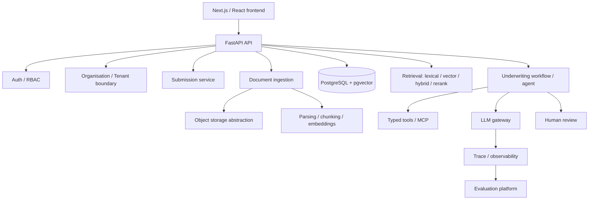

# Architecture

Status labels used throughout this document and the README: **Implemented**,
**In progress**, **Planned**. Nothing below is marked Implemented until code
exists and has been run.

## System overview (target — Planned)

This is a **modular monolith**: one FastAPI application with clearly bounded
internal modules (`api/auth/core/db/models/schemas/repositories/services/
ingestion/retrieval/agents/tools/llm/evals/observability`), not separate
deployable services. Reconsider only if a concrete scaling or team boundary
forces it — not before.

---

## Decision: Repository layout

**Context.** Need a structure that scales through ~20 roadmap stages without
forcing premature service splits or empty placeholder packages.

**Options considered.**
- Single flat FastAPI app, no monorepo packages.
- Monorepo with `apps/api`, `apps/web`, and shared `packages/*`.
- Full microservices split per domain.

**Decision.** Monorepo: `apps/api` (FastAPI), `apps/web` (Next.js),
`packages/*` created only when a package has real shared consumers (e.g.
`agent_core`, `retrieval`, `llm_gateway` once both the API and eval/benchmark
tooling need to import them). `benchmarks/`, `infra/`, `docs/` at the root.

**Why.** Matches the target directory layout in the project brief, keeps
backend/frontend independently testable/deployable, and avoids microservice
operational overhead this project doesn't need.

**Consequences.** `packages/*` will start mostly empty and fill in from
Stage 9 onward (structured extraction) and Stage 11 (retrieval benchmark) —
we will not scaffold empty packages ahead of a real consumer.

---

## Decision: Authentication approach

**Context.** Need to choose between HTTP-only cookie sessions, stateless
JWT, or an external auth provider (Auth0/Clerk/etc.), evaluated against this
project's actual deployment topology, not FastAPI defaults.

**Options considered.**

| Option | CSRF | XSS exposure | Revocation | Local dev | Operational complexity |
|---|---|---|---|---|---|
| Server-side sessions, HTTP-only cookie | Needs same-site/CSRF token | Low (token never in JS) | Immediate (delete session row) | Simple | Low |
| Stateless JWT (Authorization header) | Not applicable | Higher if stored in localStorage; lower via memory-only | Hard without a revocation list (defeats "stateless" benefit) | Simple | Low, but revocation adds a store anyway |
| External auth provider (Auth0/Clerk) | Handled by provider | Depends on integration | Provider-managed | Extra service dependency | Higher; another vendor to configure/demo |

**Decision.** Server-side sessions via HTTP-only, `Secure`, `SameSite=Lax`
cookies, backed by a `sessions` table in PostgreSQL (session id, user id,
issued/expires, revoked flag). CSRF protection via a double-submit token on
state-changing requests.

**Why.** Confirmed deployment topology: frontend and API are served under
the same origin (Next.js rewrites / shared reverse proxy in prod, same-origin
in local dev). Under same-origin, cookie sessions are the simplest option
that is secure by construction — no token ever touches JavaScript (mitigates
XSS token theft), revocation is a single-row update (unlike JWT, which needs
its own denylist to revoke — at which point it isn't meaningfully simpler
than sessions), and `SameSite=Lax` + a CSRF token on mutating requests fully
covers CSRF for this topology without cross-origin CORS complexity. An
external provider is not justified: it adds a vendor dependency and setup
friction for a portfolio project without solving a problem session auth
doesn't already solve here.

If a genuinely separate-origin deployment is introduced later (e.g. a
separately hosted marketing site), this decision should be revisited — that
is a materially different threat/ops profile and is explicitly out of scope
until it's real.

**Consequences.** Authentication (who you are) is implemented via session
cookie + `sessions` table. Authorization (what you can do) is a fully
separate server-side check (RBAC + tenant scoping) evaluated on every
request — a valid session never implies access to a given resource.

---

## Decision: Object storage abstraction

**Context.** Need to store original uploaded documents (PDFs, spreadsheets)
separately from relational metadata, without coupling ingestion code to one
cloud SDK.

**Decision (interface only at this stage).** A small `ObjectStorage`
interface — `put_object`, `get_object`, `delete_object`,
`generate_access_url` — with a filesystem-backed implementation for local
dev and an S3-compatible implementation for deployment. Concrete
implementation lands in Stage 4 (Upload/storage), not now.

**Why.** Keeps ingestion/service code storage-agnostic; swapping filesystem
for S3-compatible storage should only touch the implementation, never
callers. Avoids introducing MinIO/AWS SDK dependencies before there's a real
upload path to exercise them.

**Stage 4 update — concrete implementation.** `FilesystemObjectStorage`
(`app/storage/filesystem.py`) is now real: keys are always server-generated
(`{organisation_id}/{uuid4()}.pdf`), never derived from a client filename,
and `_resolve_path` independently verifies every resolved path stays under
the storage root as defense in depth even though callers can't currently
supply an unsafe key. `put_object`/`get_object`/`delete_object` wrap
blocking file I/O in `asyncio.to_thread` so the async event loop is never
blocked — the interface is async throughout specifically so a future
`aioboto3`-backed S3 implementation is a drop-in swap.

`generate_access_url()` deliberately raises `NotImplementedError` for the
filesystem backend rather than returning something that looks like a URL
but isn't safely usable: there's no public object store to sign a URL
against yet, and building a fake local signing scheme just to satisfy the
interface shape would be exactly the kind of half-finished feature
`CLAUDE.md` warns against. Documents are instead served through the
authenticated `GET /documents/{id}/content` endpoint, which reuses the
existing session/RBAC/tenant checks — arguably a better safe-access story
for local dev than a bare signed URL would be anyway. This method becomes
meaningful once a real S3-compatible backend exists (Stage 21).

**MinIO was considered and rejected for now.** It would make presigned
URLs "real" locally, but adds a new docker-compose service and an AWS SDK
dependency to rehearse a code path (`generate_access_url`) that isn't
reachable from anywhere yet — no ingestion pipeline exists to consume a
document by URL rather than by direct `get_object` call. Revisit if/when
something actually needs an out-of-band URL rather than an authenticated
download.

---

## Decision: Multi-tenant isolation strategy

**Context.** Cross-tenant data leakage is the single highest-severity risk
class in this system (documents may contain sensitive financial data).

**Decision.** Application-layer enforcement first: every repository method
that reads/writes tenant-owned rows requires an `organisation_id` derived
from the authenticated session's active membership — never from a request
body/query param. Service layer never accepts a bare resource ID without
also checking it resolves within the caller's organisation. Row-Level
Security (RLS) in PostgreSQL is a **candidate defense-in-depth layer**,
deferred until the application-layer boundary is implemented and tested
(explicitly flagged in the brief as "evaluate later, don't introduce
automatically").

**Why.** Application-layer checks are necessary regardless of RLS (RLS
alone doesn't stop business-logic bugs like leaking a cross-tenant ID in an
API response), and are simpler to write tests against first. RLS adds real
value as a second layer but also adds operational complexity (session
variables per connection, policy maintenance) that isn't justified until the
first layer is proven and there's a concrete incident class it would catch
that tests aren't already catching.

**Consequences.** Every new tenant-owned model/endpoint must ship with at
least one cross-tenant-denial test before being considered done (see
`CLAUDE.md` security rules).

---

## Decision: Background job execution

**Status.** Still deferred through Stage 5. Per the brief, Celery/Redis
must not be introduced by default — and this is the section that decides
when something *is* introduced.

**Stage 5 consideration.** Ingestion (parse PDF → chunk → persist) now
does real work inside the upload request. `FastAPI BackgroundTasks` was
considered specifically for this, and rejected **for now**: making it
correct requires the background task to open its own DB session/
connection distinct from the request's — which is exactly right in
production, but breaks this project's test-isolation strategy (each test
runs inside an uncommitted, savepoint-backed transaction on one shared
connection; a background task's separate connection would never see that
transaction's writes, since Postgres only ever shows committed data across
connections). Solving that properly needs a dependency-injectable session
factory the test suite can override — real, buildable complexity, not
currently justified by what it protects: ingestion here is small
test/demo PDFs and pure-CPU parsing/chunking, genuinely fast.

**Decision.** Process synchronously within the upload request
(`IngestionService`, called directly from the upload route) until
something makes that a real problem — the leading candidate is Stage 6's
embedding API calls, which are genuinely slow and involve real network
I/O, unlike PDF parsing. At that point, compare `BackgroundTasks` (with
the session-factory-override work above), a DB-backed job table, and
Redis/RQ against actual latency numbers, not speculation.

---

## Decision: Stage 2 API surface — repositories/services now, HTTP endpoints deferred

**Context.** The roadmap lists "CRUD" under Stage 2 (core domain) but auth
under Stage 3. `CLAUDE.md` forbids trusting a client-supplied
`organisation_id`; tenant context must come from an authenticated session's
membership, which doesn't exist until Stage 3 wires up auth.

**Decision.** Stage 2 delivers models, an Alembic migration, and a fully
tested repository/service layer (`OrganisationService`,
`SubmissionService`, plus repositories for `Organisation`, `User`,
`OrganisationMembership`, `Submission`, `Document`). No HTTP endpoints are
exposed yet. `SubmissionRepository`/`SubmissionService` require
`organisation_id` as an explicit parameter on every read/write and return
the same "not found" outcome whether a submission doesn't exist or belongs
to a different organisation — this is exercised directly by
`test_tenant_isolation.py` at the service layer.

**Why.** Building a real HTTP CRUD API now would mean either accepting
`organisation_id` from the client (a security violation) or building a
throwaway auth shim that Stage 3 immediately replaces (a half-finished
implementation). Testing the isolation boundary at the service layer first
means Stage 3's auth work sits on top of a layer that already can't leak
across tenants, rather than being the only thing standing between a bug and
a data leak.

**Consequences.** Stage 3 exposes `POST/GET /submissions` etc. by wrapping
these services with a dependency that derives `organisation_id` from the
session — no new business logic, just wiring.

## Decision: User model excludes credentials; Document has no service yet

- `User` (Stage 2) has no password field. Credential storage belongs to
  Stage 3 (Auth/RBAC), which owns the authentication mechanism end to end.
- `Document` has a model + repository but no service/API. Real document
  creation needs the object storage abstraction (Stage 4) to produce a
  `storage_key`; wiring an endpoint that fakes that now would be a
  half-finished feature. The repository exists so Stage 4/5 build on an
  already-tested persistence layer.

## Decision: Alembic runs via the async template

Migrations use `async_engine_from_config` + `connection.run_sync(...)`
(Alembic's standard async template) against the same `asyncpg` driver the
app uses at runtime, rather than introducing a second sync driver
(e.g. psycopg) just for migrations. One less dependency, one connection
string, no behavioral gap between "how the app connects" and "how
migrations connect."

## Gotcha: pytest against a dev DB leaves `alembic_version` lying

If you run `pytest` (with `DATABASE_URL` pointed at your local dev
Postgres, e.g. via `docker compose up -d db`) and then try to use that
same database with a live `uvicorn`/docker-compose `api` process, you'll
hit `relation "users" does not exist` even though `alembic upgrade head`
reports the schema is already at head. Cause: `tests/conftest.py`'s
session-scoped `db_engine` fixture creates the schema with
`Base.metadata.create_all()` and tears it down with
`Base.metadata.drop_all()` — deliberately, for fast test isolation — but
`drop_all()` doesn't touch the `alembic_version` table (it isn't part of
`Base.metadata`), so Alembic is left believing the schema is current when
every domain table is actually gone. This is intentional test design, not
a bug — just run `docker compose down -v db && docker compose up -d db &&
alembic upgrade head` to get a real schema back before hitting a live
server against the same database pytest just used.

## Decision: "Active organisation" lives on the session, not the URL

**Context.** A user can belong to multiple organisations (multiple
`OrganisationMembership` rows). Every tenant-scoped endpoint needs an
unambiguous `organisation_id` to scope its query — and per `CLAUDE.md`,
that can never come from trusting a client-supplied value outright.

**Decision.** `Session.active_organisation_id` tracks which org a session
is currently acting within. `GET/POST /submissions` etc. take no
`organisation_id` in the path or body — a `get_current_membership`
dependency resolves it from the session server-side, then verifies (via a
real DB lookup) that a membership actually exists for that user in that
org before returning it. RBAC (`require_role`) is layered on top of that
same membership's `role`.

**Why.** This matches the API shapes in the original brief (`POST
/submissions`, not `POST /organisations/{id}/submissions`) and mirrors how
org-switcher apps work generally: pick an active org once, then every
request implicitly operates within it. Critically, "the client sent an
org_id" and "the server trusts it" are still two different things even in
designs that DO put org_id in the path — the actual security property is
the DB membership check, not where in the request the id appears. Putting
it on the session just means callers don't have to.

**Consequences.** Switching organisations needs its own endpoint (not
built yet — no UI needs it before Stage 7's frontend exists to drive it).
Every write in `SubmissionService`/`DocumentRepository` still requires an
explicit `organisation_id` parameter at the repository/service layer —
this decision only changes how the HTTP layer derives that value, not the
tenant-isolation contract the service layer already enforces (see Stage 2
decision above).

## Decision: CSRF via double-submit token, no second cookie

**Context.** Stage 0 committed to "CSRF protection via a double-submit
token" for the cookie-session auth model.

**Decision.** The session's `csrf_token` (a random value, stored
server-side, unrelated to the session token itself) is returned in the
JSON body of `/auth/register`, `/auth/login`, and `/auth/me` — not as a
second cookie. The frontend is expected to hold onto it and echo it back
as an `X-CSRF-Token` header on every mutating request; `require_csrf`
compares it against the session row using `secrets.compare_digest`
(constant-time).

**Why.** The classic double-submit pattern uses two cookies (one
HttpOnly, one JS-readable) specifically so a same-site page can read the
second cookie via JS and echo it as a header. Since the CSRF token here is
already returned in a JSON response body — which cross-site attackers
can't read due to the same-origin policy, regardless of cookies — a
second cookie adds no additional protection over just handing the token
to the frontend directly. One fewer cookie to manage.

## Decision: SESSION_SECRET keys an HMAC, not just present for future use

`hash_token()` (app/auth/tokens.py) computes `HMAC-SHA256(SESSION_SECRET,
raw_token)` rather than a bare `SHA256(raw_token)`. The raw token already
has 256 bits of entropy from `secrets.token_urlsafe`, so this isn't
protecting against brute-forcing the hash — it gives `SESSION_SECRET` (present
in config since Stage 0/1 but previously unused) a genuine purpose:
rotating it immediately invalidates every stored session at once, since
every `hash_token` comparison starts failing. A deliberate "revoke all
sessions" operational lever, not just leftover config.

## Bug: HNSW index existed only in the migration, not the model

**What happened.** Migration 0004 hand-created the
`ix_document_chunks_embedding_hnsw` index via `op.create_index(...)`, but
`app/models/document_chunk.py` never declared a matching SQLAlchemy
`Index` (there's no `mapped_column(index=True)` equivalent for
Postgres-specific index kinds like HNSW). Since the model is autogenerate's
source of truth, `alembic revision --autogenerate` saw an index in the
database that the model didn't know about and proposed dropping it —
genuine drift, not a pgvector-type false positive.

**Fix.** Declared the same index explicitly in `__table_args__` via
`sa.Index(..., postgresql_using="hnsw", postgresql_ops={"embedding":
"vector_cosine_ops"})`, matching the migration exactly. Confirmed via a
second autogenerate pass: empty diff.

## Bug: expired `updated_at` crashed every document upload

**What happened.** Stage 5's `IngestionService` calls
`DocumentRepository.update_status` twice per upload (→ `processing`, then
→ `ready`/`failed`) within the same request, and the route immediately
serializes the same ORM object via `DocumentRead.model_validate(document)`.
SQLAlchemy's default `eager_defaults` setting only re-fetches
server-generated column values (like `TimestampMixin.updated_at`, which
has `onupdate=func.now()`) via `RETURNING` on **INSERT** — not on UPDATE.
After the second `update_status` flush, `updated_at` was left in an
expired state; Pydantic's synchronous attribute access on it triggered an
implicit lazy-refresh, which can't await the async DB round-trip and
raises `MissingGreenlet`. This crashed every valid-PDF upload (7 tests) —
caught only by a real-Postgres verification pass, exactly like the Stage
2 enum bug, since nothing about this is visible to mypy, ruff, or a
non-DB test run.

**Fix.** `TimestampMixin` now sets `__mapper_args__ = {"eager_defaults":
True}`, forcing `RETURNING` on UPDATE too, so `updated_at` stays populated
in-memory the instant `flush()` returns. Applies to every model using the
mixin, not just `Document`.

## Gotcha: the API container didn't run migrations on startup

**What happened.** `apps/api/Dockerfile` only `COPY`'d `app/`, not
`alembic.ini`/`alembic/`, and its `CMD` only ever started `uvicorn` — a
fresh `docker compose up` never actually applied migrations, silently
relying on whoever ran `docker compose up -d db` locally having also run
`alembic upgrade head` by hand at some point. Found during Stage 5
verification when a genuinely fresh volume left the api container serving
against a database with no tables.

**Fix.** `Dockerfile` now copies `alembic.ini`/`alembic/` into the image
and its `CMD` runs `alembic upgrade head && uvicorn ...` — migrations
apply automatically on container start.

**Consequence to revisit at Stage 21.** This is correct and simple for a
single-instance dev/demo deployment. A real multi-replica production
deployment would have multiple containers racing to run migrations
simultaneously on every deploy — that needs migrations as a separate
release step (a one-off job before replicas start), not part of each
replica's own startup command.

## Bug: SQLAlchemy Enum columns persisted `.name`, not `.value`

**What happened.** The initial `str, enum.Enum` / `enum.StrEnum` models
(`SubmissionStatus`, `MembershipRole`, `DocumentStatus`) used lowercase
values (`"draft"`, `"admin"`, `"uploaded"`) and the hand-written migration
created matching lowercase Postgres enum labels. `ruff`, `mypy --strict`,
and every test passed — because the DB-dependent tests all ran in an
environment with no reachable Postgres and skipped cleanly. Only when a
real Postgres instance was available (via a separate verification pass —
see below) did the real bug surface: `sa.Enum(SomeEnum, name=...)`
defaults to persisting each member's `.name` (`"DRAFT"`), not `.value`
(`"draft"`), unless `values_callable` is passed. Every insert/update
through these three columns would have failed at runtime with
`InvalidTextRepresentationError`, in an environment where mypy, ruff, and
the full non-DB test suite were all green.

**Fix.** Added `str_enum_column()` in `app/models/base.py` — a small
helper that always passes `values_callable=lambda e: [m.value for m in
e]`, used by all three enum columns, so the correct call is the only call
available. Also added `compare_type=True` to `alembic/env.py`'s migration
context — without it, `alembic revision --autogenerate` silently ignores
column-*type* drift (which is exactly what this bug was) and only compares
table/column/constraint presence, so the autogenerate drift-check that's
supposed to catch hand-written-migration mistakes wouldn't have caught
this one either.

**Why this matters for how this project is verified.** This is the concrete
argument for why `docs/architecture.md`'s "never claim unverified success"
rule is load-bearing rather than a formality: static analysis and a
"passing" test suite were both green while a real, first-write-fails bug
sat in the database layer, because the tests were (correctly) skipping
instead of exercising real Postgres. It's also why DB-dependent tests are
written to skip loudly with a clear reason when unreachable, rather than
silently — and why this project always follows up a "tests pass" claim
with a real Postgres run before treating the DB layer as done.

## Decision: Timestamps are timezone-aware

`TimestampMixin` uses `DateTime(timezone=True)` (Postgres `TIMESTAMPTZ`),
not the naive `TIMESTAMP` SQLAlchemy would otherwise default to. An audit
trail with ambiguous timestamps is a known, easy-to-miss footgun — worth
fixing before the first migration exists rather than after.

## Decision: Upload validation is layered, not a single check

**Decision.** `DocumentService.upload_document` checks, in order:
declared `Content-Type` against an allowlist (`application/pdf` only, per
the brief's "PDF first" scope), size against `MAX_UPLOAD_SIZE_BYTES`, and
finally the actual file bytes against the PDF magic number (`%PDF-`) —
rejecting a mismatch even if the declared content-type was correct.

**Why.** Per `CLAUDE.md`/the threat model, a filename extension or
declared `Content-Type` is client-asserted and never trustworthy alone —
a client can label anything `application/pdf`. Checking magic bytes is a
cheap, dependency-free way to catch that class of mistake/abuse without
needing a full PDF parser (parsing itself is Stage 5). Order matters:
reject cheap/obvious mismatches (content-type, size) before touching the
file's actual bytes.

**Consequences.** This only proves the file *starts like* a PDF, not that
it's a well-formed one — genuinely malformed or malicious PDFs (parser
exploits, decompression bombs) are Stage 5's problem once real parsing
exists, and are tracked in `docs/threat-model.md` when that's written.
Stage 5 confirms this: `IngestionService` catches parse failures against
genuinely malformed content and marks the document `failed` rather than
crashing the request — the upload itself still succeeds, since the file
*is* safely stored either way.

## Decision: PDF parser — `pypdf`

**Options considered:** `pypdf` (pure Python, BSD license), `pdfplumber`
(pdfminer.six-based, better layout/table awareness, heavier), `PyMuPDF`
(fast, but AGPL-licensed — a real consideration for a project meant to be
defensible in interviews), `pdfminer.six` directly (lower-level, more code
to own).

**Decision.** `pypdf` for baseline per-page text extraction.

**Why.** Lowest dependency footprint, permissive license, and "extract
text per page" is genuinely all Stage 5 needs — table/layout-aware
extraction is a real future upgrade (structured extraction, Stage 9) but
not required for a chunking baseline. Revisit if extraction quality on
real-world PDFs (multi-column layouts, tables) proves inadequate.

## Decision: Chunking is per-page, character-based, not token-based

**Decision.** `chunk_text()` splits one page's text at a time — chunks
never span pages — using fixed character windows
(`DEFAULT_CHUNK_SIZE_CHARS = 2000`, `DEFAULT_CHUNK_OVERLAP_CHARS = 400`)
rather than counting tokens.

**Why per-page:** `DocumentChunk.page_id` is a single foreign key, not a
list — a chunk needs exactly one page of provenance. Chunking within page
boundaries makes that unambiguous for free; cross-page chunking would
need a design for multi-page provenance that nothing here currently
needs.

**Why character-based, not token-based:** the brief's own example baseline
is expressed in tokens (500/100 overlap), but "a token" is defined by
whatever tokenizer the embedding model uses — and no embedding provider is
chosen yet (that's Stage 6). Committing to a tokenizer now (e.g. `tiktoken`)
would tie chunking to a specific provider before there's a reason to.
~4 characters/token is a commonly-cited rough heuristic for English text,
so 2000/400 characters approximates the brief's 500/100 tokens without the
dependency. This is explicitly a naive baseline — no sentence/paragraph
awareness — meant to be benchmarked against smarter chunkers later
(Stage 11), not a permanent design.

## Decision: Embedding provider — local `fastembed`, not `sentence-transformers`/API providers

**Context.** The brief wants exactly one real embedding provider behind
the `EmbeddingProvider` abstraction — no API key required was the explicit
choice here (over OpenAI/Voyage), so verification (this project's own
agents included) can exercise the real thing end to end without secrets.

**Options considered:** `sentence-transformers` (the "local model" option
initially named) pulls in `torch`, a genuinely heavy dependency (hundreds
of MB to 2GB+); `fastembed` (Qdrant's library) uses ONNX Runtime instead,
achieving the same "local, free, offline-after-first-use" intent for a
much lighter footprint (~350MB total venv including it, vs. what torch
alone would add).

**Decision.** `fastembed`, default model `BAAI/bge-small-en-v1.5`
(384 dimensions). This is a substitution for literally
"sentence-transformers," not the underlying choice — the user chose
"local model, no API key, no cost," and `fastembed` satisfies that intent
more efficiently. Flagged here explicitly per `CLAUDE.md`'s "important
architectural decisions must be visible and justified."

**Why the query/document asymmetry matters.** `EmbeddingProvider` has
separate `embed_query`/`embed_documents` methods, not one — BGE models
specifically recommend an instruction prefix on the query side only;
fastembed exposes this via distinct `query_embed`/`passage_embed` calls.
Collapsing these into one method would silently produce worse retrieval
quality for exactly the model chosen here.

**Consequence — model warm-up.** Loading the model takes a few seconds
(one-time download on first-ever run, then loading weights into memory on
each process start). `app/main.py`'s lifespan handler calls
`get_embedding_provider()` at startup specifically so this cost lands
once, at boot, rather than surprising whichever user happens to upload or
search first.

## Decision: pgvector column + HNSW index, cosine distance

**Decision.** `DocumentChunk.embedding` is a `pgvector` `Vector(384)`
column (migration 0004), with an HNSW index using `vector_cosine_ops`.
Enabling the extension (`CREATE EXTENSION IF NOT EXISTS vector`) happens
in this migration, not earlier — the pgvector *extension binary* has
shipped in the Docker image since Stage 1 (see that stage's dependency
log), but the SQL-level `CREATE EXTENSION` call is what actually registers
its types/operators in a given database, and there was nothing to index
before this stage.

**Why HNSW over IVFFlat:** IVFFlat needs a `lists` parameter tuned to
expected row count ahead of time and degrades until enough rows exist to
train it well; HNSW has no such cold-start tuning problem and generally
gives better recall/latency for small-to-medium datasets, at the cost of
slower index builds — a fine trade for this project's scale.

**Why cosine, not L2/inner-product:** `bge-small-en-v1.5` (like most
sentence-embedding models) is trained/evaluated for cosine similarity;
matching the index's distance operator to what the model actually
optimizes for is what makes nearest-neighbor search meaningful.

**Embedding column is nullable.** A chunk could in principle exist before
its embedding is computed (a future partial-failure/backfill path); the
current `IngestionService` always computes it before persisting, but
nothing forces that invariant at the schema level, so `search_similar`
explicitly filters `embedding IS NOT NULL` rather than assuming it.

## Decision: Search API and test strategy — real model vs. fake

**Decision.** `POST /submissions/{id}/search` embeds the query and
returns cosine-nearest chunks, tenant/submission-scoped, each with
`document_id`, `page_number`, `text`, and `score` (`1 - distance`) — a
source-aware result per the brief's "click a citation, see the source
page" goal, even though the citation UI itself is Stage 7+. The response
also carries `strategy` (`"vector"`, forward-compatible with Stage 10's
hybrid retrieval) and `latency_ms`, per the brief's "retrieval should
expose scores, source, strategy, latency."

**Test strategy.** HTTP-level tests (`test_search_api.py`,
`test_document_ingestion_api.py`, etc.) use `FakeEmbeddingProvider`
(`tests/fake_embeddings.py`) — a deterministic hash-based stand-in at the
*same* 384 dimensions as the real column, so it's valid against the real
pgvector schema but requires no model download and adds no per-test
latency. Its determinism gives a genuinely meaningful assertion for free:
querying with text identical to a stored chunk yields distance 0 (score
1.0), which is what `test_search_returns_exact_text_match_as_top_result`
checks. Real embedding *quality* (does "revenue growth" score higher
against a relevant sentence than an irrelevant one?) is verified
separately in `test_fastembed_provider.py`, against the actual model —
skipping cleanly if it can't load, the same pattern already used for
DB-dependent tests.

## Bug: Next.js bakes rewrites() destination at build time, not runtime

`next.config.ts`'s `rewrites()` resolves `API_ORIGIN` when it's evaluated,
and Next.js bakes the resolved destination into `.next/routes-manifest.json`
at `next build` time — `next start` does not re-evaluate it. The web
Dockerfile's build stage ran `npm run build` with no `API_ORIGIN` set
(docker-compose's `environment:` only applies at container *runtime*, not to
`docker build`), so the config fell back to `http://localhost:8000`. Inside
the `web` container at runtime nothing listens on `localhost:8000` — the API
is a separate container reachable only at `api:8000` — so every browser-side
`/api/*` call failed with `ECONNREFUSED` and the app never loaded past a
loading/500 state through docker compose. Found during Stage 7's real
browser walkthrough (a check that had no reason to run until a frontend
existed to click through). Fixed by adding `ARG API_ORIGIN` / `ENV
API_ORIGIN=$API_ORIGIN` before the build step in `apps/web/Dockerfile`, and
passing `build.args.API_ORIGIN: http://api:8000` in `docker-compose.yml`.
Verified the manifest bakes `http://api:8000` and the full user journey
(register → upload → search → logout → redirect-when-unauthenticated) works
end-to-end through docker compose.

## Bug: CI's Postgres service never had migrations applied

Every push since Stage 6 landed migration `0004_add_chunk_embeddings`
(which adds `document_chunks.embedding VECTOR(384)` and runs `CREATE
EXTENSION IF NOT EXISTS vector`) had been failing CI, invisibly: the
`backend` job's `pytest` step ran straight against the raw `pgvector/
pgvector:pg16` service container with no migration step before it, and
`tests/conftest.py`'s `db_engine` fixture creates tables via SQLAlchemy's
`Base.metadata.create_all`, not Alembic — so nothing had ever run `CREATE
EXTENSION vector` in CI's Postgres. Every DB-backed test touching
`document_chunks` (39 of them) errored with `UndefinedObjectError: type
"vector" does not exist`, while non-DB tests still passed, so the job's
final line (e.g. "25 passed, 39 errors") looked like partial-but-real
progress rather than the total DB-layer failure it was.

This was invisible throughout Stages 6–7 because every verification in
this project ran against a docker-compose Postgres that had already had
`alembic upgrade head` applied (either by the API container's own startup
command, or by a verification agent running the compose stack first) —
never against a genuinely fresh, from-scratch CI environment. Caught only
when Stage 8 checked actual CI run history (`gh run list`) instead of
assuming a workflow file that looks correct is a workflow that has passed.
Fixed by adding an explicit `alembic upgrade head` step before `pytest` in
`.github/workflows/ci.yml`'s `backend` job (safe to combine with the
fixture's own `create_all` — SQLAlchemy's `create_all` is checkfirst by
default and no-ops on tables that already exist, which migrations and
models are required to match exactly per the empty-autogenerate-diff
check done at every migration).

## Release-candidate audit before Stage 9 (Milestone 1)

Before starting structured extraction (Stage 9), Stages 1-8 were audited as
a release candidate: full-stack verification from a clean state, static
checks, three focused code reviews (security, backend architecture, test
quality), live two-organisation attack testing against the running Docker
Compose stack, and direct database inspection. Full acceptance report
delivered to the user; the durable findings are recorded here.

### Bug: ingestion could leave partial DocumentPage/DocumentChunk rows on failure

`IngestionService.ingest_document` runs entirely inside the single
request-scoped transaction (see `app/db/session.py` — one commit, at the
end of the request). Before this fix, a failure partway through parsing
(e.g. the embedding call raising after some pages were already created)
was caught by a broad `except Exception`, logged, and turned into a
`FAILED` status update — but the `except` block never re-raised, so the
outer `get_db_session` wrapper saw no exception and committed everything,
including whatever `DocumentPage`/`DocumentChunk` rows had already been
flushed before the failure. A document could end up `status=failed` with
fully-persisted page rows still attached — a partial write CLAUDE.md
explicitly forbids ("do not leave partial writes on failure").

Reproduced directly: an embedding provider that always raises, uploaded
against a real 2-page PDF, left both `DocumentPage` rows committed and
queryable via `GET /documents/{id}/pages` even though the document was
`failed`. Fixed by wrapping the parse/chunk/embed/persist block in
`async with self._db.begin_nested()` — a SAVEPOINT that rolls back
everything written inside it on exception, while leaving the outer session
(and the subsequent `FAILED` status update) intact. Re-ran the same
reproduction after the fix: pages list is now empty. Permanent regression
test: `tests/test_ingestion_atomicity.py`.

### Bug: an uploaded file could be orphaned on disk if the DB row failed to persist

`DocumentService.upload_document` wrote the file to storage, then created
the `Document` row — with no compensating action if the row creation
failed after the file write succeeded (the file write isn't part of the
DB transaction). Reproduced directly: calling `upload_document` with a
`submission_id` that doesn't exist (FK violation on flush) left a real
file on the test's storage root with no DB row and nothing accounting for
it. Fixed by catching the exception, deleting the just-written object, and
re-raising. Permanent regression test: `tests/test_document_service.py`
(confirmed to fail without the fix, by temporarily reverting it and
re-running).

### Fix: upload size limit was enforced only after buffering the whole body

`documents.py`'s upload route read the entire request body into memory
(`await file.read()`) before `DocumentService` checked it against
`max_upload_size_bytes` — so an arbitrarily large or malicious upload was
fully buffered before being rejected. Changed to a bounded, chunked read
(`_read_upload_bounded`, 1 MiB chunks) that raises `413` as soon as the
cumulative size crosses the limit, without buffering past it. The
service-layer check remains as a backstop for any other caller.

### Fix: `ruff format --check` was never run — 6 files had drifted

CI and local instructions only ever ran `ruff check` (lint rules), never
`ruff format --check` (formatting). Running it during the audit found 6
files that had drifted from the formatter's output (all whitespace/line-
wrapping, no logic changes). Reformatted with `ruff format .` and added a
`Format check (ruff)` step to CI's `backend` job, between lint and mypy,
so this can't silently reaccumulate.

### Fix: constraint violations reaching the API had no clean translation

No route currently reachable through ordinary use can trigger a raw
`IntegrityError` (every write path checks first), but there was no global
handler for one — a future write endpoint that races a unique constraint
(e.g. a Stage 9+ membership invite) would surface Starlette's generic,
unhelpful 500 rather than a clean error. Added an `IntegrityError`
exception handler in `app/main.py` returning `409 Conflict`. (Starlette's
default 500 handler already hides exception internals from the client
outside debug mode, so this isn't an information-leak fix — it's a
usability one, ahead of endpoints that don't exist yet.)

### Coverage added: repository-level tenant isolation with both orgs' data present

Every existing cross-tenant test relied on an earlier gate (the owning
submission/document lookup returning nothing, 404ing before the
repository's own `organisation_id` filter ever ran) — so if that filter
were ever dropped in a refactor, none of the existing tests would catch
it. Added `test_document_page_repository_excludes_other_org_pages_when_both_present`
and `test_document_chunk_repository_excludes_other_org_chunks_when_both_present`
to `tests/test_tenant_isolation.py`, which create two real organisations'
data (including two chunks with real embeddings, org B's deliberately the
*nearer* vector match) and call the repository directly. Confirmed these
catch the regression: temporarily removing the `organisation_id` filter
from `search_similar` made org B's chunk leak into org A's results (and
rank first) — the test failed exactly as expected; restored, it passes.

### Coverage added: search input bounding

`SearchRequest.limit` (`ge=1, le=50`) and `query` (`min_length=1,
max_length=1000`) were constrained in the schema but never tested. Added
`test_search_rejects_empty_query`, `test_search_rejects_overlong_query`,
`test_search_rejects_out_of_range_limit`, and
`test_search_limit_bounds_the_number_of_results` to `tests/test_search_api.py`.

### Live two-organisation attack test (Docker Compose, real browser-equivalent HTTP)

Ran a black-box attack script (curl, two independently-registered
organisations, real PDF upload) against the full `docker compose up
--build` stack — not against the test suite. Org B's session, holding a
real UUID from Org A, was denied on: `GET /submissions/{id}`, `PATCH
/submissions/{id}`, `GET /submissions/{id}/documents`, `GET
/documents/{id}`, `GET /documents/{id}/pages`, `GET /documents/{id}/content`,
and `POST /submissions/{id}/search` (all `404`, not `403` — no
existence leak). A search for Org A's exact stored text, run inside Org
B's *own* submission, returned zero results (no cross-tenant inference).
An unauthenticated request returned `401`. Sanity-checked the *positive*
path in the same run: Org A reading its own submission/pages/search
returned `200` with correct data, and a direct `psql` query joining
`document_chunks -> documents -> submissions -> organisations` confirmed
`organisation_id`/`submission_id` are consistent end-to-end for the
persisted row.

### Known, deliberately deferred (not fixed in this audit)

- **No pagination on list endpoints** (`list_submissions`,
  `list_submission_documents`, `list_document_pages`,
  `list_for_document` for pages/chunks) — unbounded today, fine at current
  scale, real once a submission accumulates hundreds of pages/chunks or an
  org accumulates years of submissions. Deferred: fixing it properly means
  changing four response shapes, which is a small API contract expansion,
  not a bugfix — better done deliberately with the rest of the API surface
  than folded into an audit.
- **No rate limiting / lockout on `POST /auth/login`.** Argon2id slows
  each attempt but doesn't substitute for throttling. Deferred: needs a
  library/middleware decision, not a contained code fix.
- **`PROCESSING` status is never observable mid-request**, and the
  request-scoped DB connection is held for the full parse+chunk+embed
  duration (a connection-pool exhaustion risk under concurrent uploads).
  Both are consequences of the deliberate synchronous-ingestion design
  (see the Background job execution decision above) and aren't new — the
  audit confirmed they're real but didn't change the architecture; moving
  ingestion to a background job is a bigger decision than this audit's
  scope.
- **`SessionRepository.set_active_organisation` is unreachable dead
  code** (no route calls it yet). Not a vulnerability; flagged for when a
  future "switch active organisation" endpoint is added — that endpoint
  must re-verify membership server-side before calling it.

## Decision: Stage 9 LLM provider — local Ollama, not a hosted API

**Context.** Stage 9 (structured extraction) is the project's first actual
LLM call — everything through Stage 8 used only local embeddings. The
brief's `llm_gateway` abstraction had no concrete implementation yet.

**Options considered.** Anthropic Claude API (originally proposed —
strong structured-output support, but needs a real API key and incurs
real per-call cost) vs. an open-weight model. Once redirected toward
open-source, two further options: an open-weight model via a hosted API
(Groq/Together/OpenRouter — still needs a key and costs money, but far
more reliable structured output than a small model) vs. a fully local
model via Ollama (no key, no cost, weaker reasoning).

**Decision.** Local via Ollama, `qwen2.5:3b` (already installed/pulled in
this dev environment). Mirrors the Stage 6 embedding decision exactly:
"local model, no API key, no cost" over a hosted provider, this time by
explicit user direction rather than the brief's default.

**Consequence — provenance must be deterministic, not model-asserted.** A
3B-parameter local model is meaningfully less reliable at complex
structured reasoning than a frontier hosted model (confirmed in real
end-to-end verification below: 3 of 5 target fields correctly extracted
from a realistic two-page submission, zero hallucinated values). Asking
the model to also name its own source chunk/page — the obvious design —
would need a deterministic *existence* check (does this chunk_id exist,
does it belong to this submission) to satisfy CLAUDE.md's "prefer
deterministic logic," but existence isn't *correctness*: a model could
cite a real chunk that isn't actually where the value came from, and an
existence check can't catch that. Instead, `ExtractionService` runs one
`generate_structured` call **per chunk**, asking only "what's in this
specific chunk" and keeping the first non-null value found per field
across chunks (in chunk order). The chunk a value came from is therefore
always the chunk that was actually being read — never asserted by the
model, never in need of a trust-but-verify check. Confirmed correct in
live verification: values extracted from page 2 cited page 2, values from
page 1 cited page 1, in every run.

**Consequence — no per-call cost or key means more, smaller calls are
fine.** One `generate_structured` call per chunk (rather than one call
over the whole submission) would be a bad tradeoff against a paid API;
against a free local model, it's simply the safer design per the point
above, at the cost of some latency (a few seconds per chunk on CPU).

**Consequence — kept out of docker-compose and CI.** Bundling Ollama in
`docker-compose.yml` would mean baking or pulling a multi-gigabyte model
on every `docker compose up --build`, which would make CI's
`docker-compose` job slow and flaky for a check that currently only needs
to confirm the stack boots. Structured extraction is therefore verified
two ways instead: `tests/fake_llm_gateway.py`-backed tests (run in CI,
exercise the full pipeline's logic deterministically) and
`tests/test_ollama_gateway.py` (real model, skips cleanly if Ollama isn't
reachable — same pattern as `test_fastembed_provider.py` for DB/model
dependencies). Confirmed the failure mode is clean, not a crash: with the
full `docker compose up --build` stack running (where the API container
can't reach a host-run Ollama at the default `localhost:11434`, since
that resolves to the container itself), `POST /submissions/{id}/extract`
against a real uploaded document returned `200` with
`{"status": "failed", "fields": []}` — no 500, no impact on any other
route. A developer who wants extraction working through Docker Compose
needs to point `OLLAMA_BASE_URL` at a reachable Ollama (e.g. run Ollama
natively and use `host.docker.internal`, network-permitting) — not
attempted or verified here; the native `apps/api` dev flow (venv +
uvicorn, both processes on the host reaching `localhost:11434` directly)
is what's actually verified end-to-end.

**Real end-to-end verification.** Registered a user, created a
submission, uploaded a real 2-page PDF with realistic underwriting
submission text (named insured, business description, effective date on
page 1; broker name and coverage limit on page 2), and called
`POST /submissions/{id}/extract` against the real `qwen2.5:3b` model via
Ollama (not the fake). Result: `business_description`, `broker_or_agent_name`,
and `requested_coverage_limit` were extracted correctly, verbatim from the
source text, each citing the correct source page (1, 2, and 2
respectively) — confirmed by direct `psql` inspection of the persisted
`extraction_runs`/`extracted_fields` rows, and by `GET
/submissions/{id}/extraction` returning identical data to what the
triggering `POST` returned. `named_insured` and
`requested_effective_date`, both genuinely present in page 1's text, were
*not* extracted — a real, honestly-reported reliability gap of the 3B
model at this task, not a bug in the pipeline: the model returned null
for those fields rather than inventing a wrong value, which is the
correct failure mode for an underwriting tool (silence, not confident
fabrication).

## Decision: Stage 10 hybrid retrieval — Postgres full-text + RRF, not a separate search engine

**Context.** Stage 6 shipped pure vector (semantic) search. Vector search
alone is known to underperform on exact identifiers, codes, and rare
terms (policy numbers, SKUs, proper nouns) that an embedding model has no
particular reason to weight — the classic justification for hybrid
retrieval.

**Options considered.** A dedicated search engine (Elasticsearch/
OpenSearch/Meilisearch) vs. Postgres's built-in full-text search
(`tsvector`/`tsquery`, GIN index). CLAUDE.md is explicit that PostgreSQL
is the source of truth and new infrastructure needs a concrete technical
reason — running a second search system to index the same `text` column
already sitting in Postgres would be exactly the kind of premature
infrastructure the project's architectural principles rule out. Postgres
full-text search isn't as tunable as a dedicated engine, but this
project's scale (a handful of documents per submission, not a
web-search-sized corpus) doesn't come close to needing that.

**Decision.** A generated, always-in-sync `search_vector` column
(`GENERATED ALWAYS AS (to_tsvector('english', text)) STORED`, migration
0006) with a GIN index, queried via `websearch_to_tsquery` (accepts
natural search-box syntax: quoted phrases, `-` to exclude, implicit AND)
and ranked with `ts_rank_cd`. Merged with the existing pgvector cosine
search via **Reciprocal Rank Fusion** (RRF): each chunk's final score is
the sum of `1/(60 + rank)` across whichever of the two ranked lists it
appears in (a chunk found by only one method still contributes; a chunk
found by both, even at different ranks, accumulates both). RRF was chosen
over a weighted linear blend of the two scores because cosine distance
and `ts_rank_cd` are on incomparable scales — a weighted sum would need
an arbitrary normalization step to mean anything, where RRF only needs
each list's *rank order*, which both already produce natively.

**Consequence — the API's `score` field changed meaning.** It's no
longer `1 - cosine_distance` (a 0..1 relevance-ish number); it's now an
RRF value, meaningful only for ranking within one query's results, not
comparable across queries or interpretable as a percentage. Documented on
the `SearchResult.score` field itself, and `strategy` now reports
`"hybrid"` instead of `"vector"`.

**Consequence — each underlying search over-fetches.** Both
`search_similar` and `search_lexical` are called with a candidate pool
larger than the final result limit (`max(limit * 3, 20)`) before RRF
trims to `limit` — with only `limit` candidates from each side, a chunk
found by just one method could never outscore one found by both,
regardless of how strong its individual rank was, which would silently
defeat the point of fusing two signals.

**Real verification.** Against the live Docker Compose stack with the
real embedding model (not the fake): a 3-page submission with a revenue
sentence, a page containing a specific policy number
("ABC-99182-XY"), and an irrelevant distractor. Querying the exact policy
number ranked that page first (lexical match — an embedding model has
little reason to weight an arbitrary alphanumeric code highly). Querying
a paraphrase with no literal word overlap ("quarterly earnings
increased" vs. stored text "revenue grew ... sales performance") still
correctly ranked the revenue page first — proving the vector half is
doing genuine semantic work, not just falling back to keyword overlap.
Also proven deterministically in `tests/test_hybrid_retrieval.py`, which
hand-constructs embeddings so a lexically-relevant chunk is the *worst*
possible vector match and a lexically-irrelevant chunk is the *best*
possible vector match — hybrid correctly ranks the relevant one first.

## Decision: Stage 11 retrieval benchmark — a top-level `benchmarks/` package, borrowing `apps/api`'s code

**Context.** Stage 10's hybrid retrieval decision left the RRF constant
(`k=60`) undefended by data — "no benchmark yet to tune against." A
retrieval benchmark is also the first thing in this repo whose natural
consumer is not `apps/api` itself, which is exactly the trigger condition
the repository layout decision (Stage 0) set for creating a top-level
package: `benchmarks/`, `infra/`, `docs/` at the root, `packages/*`
"created only when a package has real shared consumers."

**Decision.** `benchmarks/retrieval/` at the repo root, not a shared
extracted `packages/retrieval` — it imports `apps/api`'s actual
`RetrievalService`/`DocumentChunkRepository` directly via `sys.path`
(run inside `apps/api`'s own virtualenv), rather than the repo layout
decision's originally-imagined route of extracting shared code into its
own installable package. There is still exactly one *runtime* consumer of
retrieval logic (the API); a benchmark script borrowing that code to run
offline doesn't need it published as a separate package — that refactor
would touch a currently fully-green system for no benefit this stage
actually needs. Revisit if a second real runtime consumer (e.g. an eval
harness with its own deployment) ever appears.

**Design — hand-labeled fixtures, not real ingestion.** The benchmark
authors 12 chunks and 12 queries by hand (`benchmarks/retrieval/
dataset.py`) rather than running real PDFs through `IngestionService`'s
chunker. This measures retrieval quality specifically, not chunking
quality — with hand-authored, single-fact chunks, "is this the right
chunk" has one unambiguous answer per query, which running real chunking
(with its own boundary decisions) would confound.

**Design — seeds inside a rolled-back transaction.** The script opens one
session, seeds fixture data (org/user/submission/document/pages/chunks
with real embeddings), runs every query, then always rolls back —
mirroring the test suite's own transactional-isolation pattern. Verified
directly: ran the benchmark, then queried Postgres — zero rows from it
persisted anywhere.

**Real result — more nuanced than "hybrid always wins."** Against the
real embedding model, vector-only already scored Recall@5 = 1.000, MRR =
0.840 on this query set (mostly natural-language questions, e.g. "Who is
the broker on this submission?"), while lexical-only scored Recall@5 =
0.333 — it only found the relevant chunk when actual vocabulary
overlapped (an exact policy number; a few queries that happened to reuse
fixture words like "liability limit"). Several queries share **zero**
literal words with their relevant chunk (e.g. "broker" never appears in
the fixture text — it says "submitted by Meridian Risk Partners" — so
lexical search has nothing to match, not a stemming failure). Hybrid tied
vector exactly on both metrics: with vector already correct everywhere,
RRF had nothing to correct, only to (in the few keyword-overlap cases)
reinforce.

This is a legitimate, honest empirical finding, not left as a "hybrid
underdelivered" gap: hybrid never scored *worse* than the better
individual signal — RRF's floor is exactly "as good as whichever method
worked," and Stage 10's own targeted checks (a real live query for an
exact policy number, and `tests/test_hybrid_retrieval.py`'s
hand-constructed embeddings) already demonstrate the case hybrid exists
for — a strong embedding model beating rare identifiers, not average-case
natural-language questions. Twelve queries against one strong embedding
model isn't a large or adversarial enough sample to conclude vector-only
would suffice in general; it's a sample that happened to favor vector
this time. **`_RRF_K` was left at 60**, unchanged — a 12-query benchmark
isn't a sound basis for retuning a production constant either way; the
sweep (`k` from 10 to 200) showed identical results at every tested
value, which itself is unsurprising with such a small candidate pool
size relative to `k` (see `benchmarks/README.md` for how to extend the
dataset before drawing a stronger conclusion).

## Decision: Stage 12 agentic workflow — a fixed-sequence pipeline, not a dynamic tool-selection loop

**Context.** "Agentic workflow" is usually taken to mean a ReAct-style
loop where the model itself decides which tool to call next and when to
stop. This project's own CLAUDE.md rules point the other way for a task
like underwriting triage: "prefer deterministic logic over LLM calls
wherever possible," and Stage 9 already demonstrated the local 3B model's
real limits at complex structured reasoning (3 of 5 fields extracted
correctly, honestly reported rather than hidden).

**Decision.** `AgentService.run_triage` runs a **fixed sequence** — gather
evidence, read extracted fields, apply deterministic rules
(`app/agents/underwriting_rules.py`), then (only) ask the model to write
a narrative summary of already-decided findings. The model never
determines `recommendation`; `determine_recommendation` is plain Python
over rule-generated severity flags. Every step is still logged as an
`AgentToolCall` row (CLAUDE.md: "tool calls are typed, validated, and
auditable"), satisfying the audit requirement without needing a pluggable
tool-registry this project has no second consumer for. The underwriting
rules themselves (missing named insured → high; missing coverage limit →
medium; missing broker/effective date → low) are a first, deliberately
simple set — a real starting point, not a placeholder, and easy to extend
without touching the pipeline shape around them.

**Why the LLM is never asked to decide.** The prompt handed to the model
(`_build_summary_prompt`) explicitly instructs it to restate the given
recommendation, not invent one — but the actual `AgentRun.recommendation`
column is never populated from anything the model returns, so even if the
model ignored that instruction in its prose, the stored, consequential
field would be unaffected. Verified live: the real model's summary
correctly echoed "refer" without being asked to compute it itself.

**Decision — human approval is unconditional in this first version.**
Every `AgentRun` has `requires_human_approval = True`; there is no
`decline` recommendation the agent can produce (see
`RecommendationType`'s docstring) and no code path where a run's output
mutates `Submission.status` automatically — approving a run
(`POST /agent-runs/{id}/approve`, admin-only) records who signed off and
when, and nothing else. A human choosing to act on that recommendation
does so through the existing `PATCH /submissions/{id}` endpoint,
independently. This is a deliberately conservative first version of
"consequential actions require... human approval" (CLAUDE.md) — a richer
approval policy (auto-approve low-risk cases, wire recommendations to a
real workflow state machine) is a real future decision, not one to back
into now.

**Real end-to-end verification**, native (non-Docker) flow, real
`qwen2.5:3b`: uploaded a realistic 2-page submission, ran extraction (3 of
5 fields, consistent with Stage 9's documented result), then ran triage —
correctly flagged the missing named insured (high) and missing effective
date (low), correctly recommended "refer," and the model's narrative
summary accurately restated exactly the given facts and findings without
inventing anything. Approved the run as admin; `approved_by_user_id`/
`approved_at` populated correctly, confirmed via direct `psql`. A second
organisation's session was denied `404` on both reading and approving the
first org's run. Through the full `docker compose up --build` stack
(Ollama unreachable from inside the `api` container, same constraint as
Stage 9): the endpoint still returned `201` with `status: "failed"` and a
clear error — the three deterministic steps ran and were logged correctly
before the LLM call failed — no crash, no impact on any other route.

**Bug found and fixed before it shipped:** `FakeLLMGateway` didn't wrap a
Pydantic validation failure into `LLMGenerationError`, unlike the real
`OllamaGateway` — latent because `ChunkExtraction`'s fields are all
optional (so `model_validate({})` never raised), only surfacing once
`TriageSummary.summary` (a required field) needed the same fallback path.
Fixed so the fake matches the interface's actual contract
(`generate_structured` never raises anything but `LLMGenerationError`).

## Decision: Stage 13 MCP — this platform as an MCP *server*, not an MCP *client*

**Context.** "MCP tool integration" has two natural readings: the
existing triage agent calling out to *external* MCP tool servers, or this
platform exposing *its own* capabilities as MCP tools for an external
client to call. Asked the user directly rather than guessing — this is a
genuine fork, not a case where the project's own principles point clearly
one way.

**Decision.** This platform as an MCP server. Making the triage agent an
MCP client would need either a real external MCP server to depend on or a
second toy one built just to call — in both cases a new external
dependency for a fixed-sequence pipeline that (per the Stage 12 decision)
deliberately doesn't do dynamic tool selection anyway. Exposing this
platform's own capabilities is self-contained and directly demonstrates
the tool-permission principles CLAUDE.md already commits to.

**Design — a thin HTTP-proxying layer, not a new auth/permission system.**
`mcp_server/server.py`'s tools (`list_submissions`, `get_submission`,
`search_submission`, `get_extraction`, `list_agent_runs`,
`get_agent_run`, `trigger_triage`, `approve_agent_run`) are each a direct
wrapper (`mcp_server/api_client.py`) around a real HTTP call to the real
running API, authenticated with a real session obtained through the real
`/auth/login` flow (`mcp_server/login.py` — a one-time helper, not part of
the server process). This was the central design choice: an alternative
"service account" or API-key auth mechanism built specifically for MCP
would be a **second** place enforcing tenant isolation and RBAC, needing
its own audit from scratch. Proxying the real HTTP API with a real
browser-equivalent session means the MCP layer inherits every existing
guarantee unchanged and makes zero new trust decisions — "tool
permissions come from trusted application config... never from model
output" (CLAUDE.md) holds trivially, because the config *is* the
session's role, exactly as it is for the web frontend.

**Why a separate root-level `mcp_server/`, with its own venv (not
borrowing `apps/api`'s, unlike `benchmarks/`).** `benchmarks/` imports
`apps/api`'s Python code directly (same process, same dependencies:
SQLAlchemy, fastembed, etc.) — `mcp_server/` doesn't import any of that;
it only ever makes HTTP calls, so it needs just `mcp` and `httpx`. Giving
it apps/api's full dependency set would be dead weight. Same repository-
layout principle as Stage 11 (a top-level package only once something
outside `apps/api` needs to exist), applied with a different concrete
answer because the actual coupling is different.

**Real end-to-end verification**, native (non-Docker) flow, real login
against a real running API: registered a user, created and uploaded a
document to a submission, ran `login.py` for a real session, then drove
`server.py` as a real MCP server subprocess with the actual `mcp` Python
client library (not a mock) — every tool call succeeded for real:
`list_submissions`, `get_submission`, `search_submission`,
`trigger_triage` (a real triage run against the real `qwen2.5:3b` model,
correctly flagging missing fields and recommending "refer"), and
`approve_agent_run` (confirmed via direct `psql` that
`approved_by_user_id`/`approved_at` were set). Also verified the failure
path deliberately: calling `get_submission` with a nonexistent id
correctly raised `ApiError` inside the tool, which the MCP framework
caught and surfaced as a clean tool-level error (`is_error: True`) — not
a crashed server and not a leaked stack trace to the client. Verified
tenant isolation live: a second organisation's MCP session saw an empty
`list_submissions` result and got the same clean tool-level error
attempting to read or search the first organisation's submission by id —
inherited automatically from the underlying API's existing tenant
scoping, with no MCP-specific isolation code to get wrong.

## Decision: Stage 14 AI tracing — a transparent wrapper layer, infrastructure-scoped, not tenant-exposed

**Context.** CLAUDE.md says "AI runs (agent runs, model calls, retrieval
calls, tool calls) are traced and persisted." `ExtractionRun`/`AgentRun`
(Stages 9/12) already cover the business-level runs, but the individual
calls underneath them — every LLM generation, every embedding call, every
retrieval search — had no tracing of their own before this stage; nothing
recorded latency, provider/model, or failure independent of whichever
feature happened to be calling in.

**Decision.** `TracingLLMGateway`/`TracingEmbeddingProvider`
(`app/observability/`) wrap the real `OllamaGateway`/`FastEmbedProvider`
behind the same `LLMGateway`/`EmbeddingProvider` interfaces, applied once
in the two factory functions (`get_llm_gateway`, `get_embedding_provider`)
— every existing caller (extraction, triage, ingestion, retrieval) is
traced automatically with zero code changes anywhere else, because they
already depend only on the interface, never the concrete class. Retrieval
search doesn't route through either provider abstraction on its own (it
calls `embed_query`, which *is* traced, plus two repository queries,
which aren't behind any shared abstraction) — `RetrievalService.search`
records an explicit `retrieval_search` trace around the whole operation
for that reason, the one place tracing isn't "free" from wrapping a
factory.

**Decision — trace writes use their own session, independent of the
calling request's transaction.** `TracingLLMGateway`/
`TracingEmbeddingProvider` are constructed once as process-wide
singletons (same `@lru_cache` pattern as before) with no request-scoped
session available at call time — there's no session to reuse even if
this weren't otherwise the right call. And even in `RetrievalService`,
which does have one: a trace should survive regardless of whether the
surrounding business transaction later rolls back — the fact a call was
attempted, and what happened, is exactly what you want preserved when
something else in the request fails. `record_ai_call`
(`app/observability/tracer.py`) opens a short session via the same
`get_sessionmaker()` every other DB access already uses, commits
immediately, and never raises — a broken tracer must never break the AI
call it's describing (same boundary-call pattern as `ping_database`).

**Decision — no organisation_id, and no new HTTP endpoint yet.**
`ai_call_traces` is deliberately un-scoped to any tenant: this is
operational/SRE-facing data (model health, latency, error rate) analogous
to a server log line, not tenant business data, and the provider-
abstraction layer these calls happen at has no tenant context to attach
even if it were wanted — `LLMGateway`/`EmbeddingProvider` are intentionally
tenant-agnostic ML-provider interfaces. Exposing this data through the
tenant-facing API would need a cross-organisation "platform operator"
role that doesn't exist anywhere in this app's RBAC model (`admin` is
scoped to one organisation, same as every other role) — inventing one
just to expose a trace-viewer is a bigger, separate decision than "add
tracing," and not one to make by accident as a side effect of this stage.
For now, this data is visible via direct `psql` queries and
`apps/api/scripts/ai_traces_report.py` (count/avg-latency/error-rate per
call type, plus recent failures) — a real, runnable tool, not a
placeholder, just not a network-exposed one yet.

**Real verification.** Ran a full journey (register → upload → search →
extract → triage) against the real embedding model and real `qwen2.5:3b`,
then confirmed via both `psql` and the report script: one
`embed_documents` trace (ingestion), one `embed_query` and one
`retrieval_search` trace (search), two `llm_generate` traces (extraction
+ triage synthesis) — every call accounted for, correct provider/model,
0% error rate. Then, through the full Docker Compose stack (Ollama
unreachable from inside the `api` container — the same constraint
extraction and triage already document), triggered a real triage failure
and confirmed a `llm_generate` trace was recorded with `status: failure`
and the full error message, both via `psql` and via the report script's
"most recent failures" section, correctly showing a 100% error rate for
that call type.

## Decision: Stage 15 evaluation harness — deterministic for extraction, LLM-as-judge only for summary faithfulness

**Context.** CLAUDE.md's AI rules: "Prefer deterministic evaluators in
the eval platform; LLM-as-judge only for genuinely semantic dimensions,
and only with versioned prompts and structured output." Two AI-output
features existed with no systematic quality measurement — extraction
(Stage 9) and the triage summary (Stage 12) — and they call for two
different kinds of evaluator, not one generic "eval" tool.

**Decision.** `evals/extraction/`: scores the real `ExtractionService`
against a hand-labeled dataset via normalized substring matching — no LLM
call. Whether the extracted text contains "$500,000" is a plain string
comparison, not a judgment call. `evals/triage_faithfulness/`: the one
genuinely semantic question in this app — does the triage summary
accurately restate exactly the facts/findings it was given, without
inventing anything or contradicting the recommendation — judged by a
second LLM call (same `llm_gateway`, no new provider), with a versioned
prompt constant (`JUDGE_PROMPT_VERSION`) and a structured
`FaithfulnessVerdict` schema. The recommendation itself is never judged
here; it's deterministic (`app/agents/underwriting_rules.py`) and already
covered by unit tests — an eval for it would just be re-testing code that
already has no randomness to evaluate.

**Why a new `evals/`, not extending `benchmarks/`.** Same tooling shape
(labeled dataset + runner + metric, same rolled-back-transaction seeding
pattern) but a different purpose: `benchmarks/retrieval/` (Stage 11)
tunes *ranking quality* — there's no ground-truth "correct" ordering, just
better/worse. `evals/` measures AI-output *correctness against ground
truth or a faithfulness standard* — closer to a regression/compliance
check than a tuning tool. The roadmap itself names these as separate
stages (11 and 15) for the same reason; conflating them into one
"benchmarks" tool would blur a real conceptual distinction for the sake
of directory-count convenience.

**Real, honestly-reported result — the judge caught something, including
about itself.** Ran both evaluators against the real `qwen2.5:3b` model,
twice each. Extraction: 100% precision, 80% recall across 4 hand-labeled
cases (zero hallucinations, 2 missed fields) — a systematic confirmation
of Stage 9's one-off observation, not a new finding. Triage faithfulness:
all 4 scenarios scored `faithful: true` in both runs, but the *reasoning
quality varied run to run*, not just case to case — the first run's
scenario 3 judge reasoning was self-inconsistent (names a real omission
as "a flaw in the summary" while still returning `faithful: true`, and
separately mischaracterizes a `low`-severity finding as high-severity),
while the second run over the identical scenarios produced fully
coherent, correct reasoning throughout with no such errors. Documented
plainly in `evals/README.md` rather than smoothed over: a small local
judge model is a real, useful signal for gross failures (invented facts,
contradicted recommendations), not a stable, precise pass/fail on its
own — its `issues` output needs a human to actually read it on any given
run, which is exactly what versioned, structured LLM-as-judge output is
for.

## Decision: Stage 16 model routing — two local models via Ollama, a caller-supplied complexity hint, no hosted fallback

**Context.** Stage 12 and Stage 15 both independently found the same weak
spot in the single `qwen2.5:3b` model: its *reasoning* quality (not its
factual recall) was where it struggled — Stage 15's faithfulness judge in
particular showed reasoning that was inconsistent run to run on identical
input. The roadmap calls for "model routing" at Stage 16; the real
question was what to route between and on what signal, without
introducing a hosted API key/cost the rest of this project has
deliberately avoided since Stage 9.

**Decision.** Pull a second, larger local model (`qwen2.5:14b`, no new
provider, no API key — same rationale as the original `OllamaGateway`
decision) and add a `RoutingLLMGateway` that sits behind the same
`LLMGateway` interface every caller already uses. Routing is driven by an
explicit `TaskComplexity` enum (`SIMPLE`/`COMPLEX`) the *caller* passes in
— extraction's per-chunk call, the triage synthesis call, and the eval
judge's call each know whether their own task is high-volume/routine or
reasoning-heavy; nothing below that layer could infer it from the prompt
text without adding a real classification step of its own, which would be
strictly more machinery for a signal the caller already has for free.
`RoutingLLMGateway` does two distinct things with that hint: (1)
`complexity=COMPLEX` always goes to the capable tier — used by triage
synthesis and the eval judge, the two calls Stage 12/15 identified as
reasoning-heavy; (2) on the fast tier, any `LLMGenerationError` (model
unreachable, or malformed output surviving the fast gateway's own bounded
retry) escalates once to the capable tier before giving up — a resilience
behavior for outages, not a fix for Stage 9/15's "missed field" gap (a
`null` field isn't a failure this layer can see at all, only the eval
harness comparing against ground truth can).

**Why extraction stays on `SIMPLE` by default.** Extraction runs once per
chunk, so defaulting every call to the 14B model would multiply latency
across a whole submission for a cost/latency tradeoff, not a demonstrated
reliability gap this call itself could detect. This is stated explicitly
in the code as a deliberate choice, not an oversight.

**Why `TracingLLMGateway` wraps each model individually, not the router
from outside.** `get_llm_gateway()` constructs `TracingLLMGateway(fast)`
and `TracingLLMGateway(capable)` separately and hands both to
`RoutingLLMGateway(fast=..., capable=...)`, rather than wrapping one
`TracingLLMGateway` around the finished router. Wrapping the router would
have made every trace row report a single generic identity regardless of
which tier actually served the call, destroying exactly the kind of
per-model visibility Stage 14's tracing exists to provide (how often each
tier is used, how often escalation triggers). Wrapping each model first
means `ai_call_traces.model` always reflects the model that actually ran.

**Real, live-verified result.** Ran the full extract → triage journey
against the real, freshly-migrated stack: the extraction call traced as
`provider=ollama, model=qwen2.5:3b, call_metadata={"complexity": "simple"}`
and the triage call traced as `provider=ollama, model=qwen2.5:14b,
call_metadata={"complexity": "complex"}` — confirmed directly via
`ai_call_traces`, not inferred. Separately, misconfigured `OLLAMA_MODEL` to
a nonexistent model to force a real fast-tier failure (Ollama returned an
actual 404): the request still succeeded, `ai_call_traces` shows the
failed fast-tier attempt (`status=failure`, real error message) followed
by a successful capable-tier attempt for the same call, and the
`logger.warning("fast-tier model failed, escalating to capable tier")`
line appeared in the server log — the full escalation path proven live,
not just unit-tested. Re-ran both Stage 15 evaluators under the new
routing: extraction unchanged (100% precision / 80% recall, still on the
fast tier as designed); the faithfulness judge — now on the capable tier —
scored 4/4 faithful with clean, self-consistent reasoning on every
scenario, no repeat of Stage 15's documented run-to-run inconsistency.
One run is not proof the capable tier eliminates that inconsistency
entirely, but it is a concrete, favorable data point for the routing
decision this stage made.

## Decision: Stage 17 eval-integrated CI — a fake-model smoke test, not the real evaluators, run in CI

**Context.** CLAUDE.md's Commands section carried a placeholder since
Stage 15: "Eval smoke test: _TBD (Stage 17)_." Neither `evals/extraction/`
nor `evals/triage_faithfulness/` (Stage 15) runs in CI today — both need a
real Ollama model, which CI's runners don't have and won't be given one
(consistent with keeping CI fast, hermetic, and free of a multi-GB model
download on every push). The real question for this stage was what a CI
"eval smoke test" could actually check without that model.

**Decision.** Split each evaluator's `run.py` into a reusable async
function (`run_extraction_eval`, `run_triage_eval`) that takes the
`LLMGateway` as a parameter, and a thin `main()` that wires in the real
gateway via `get_llm_gateway()` for a genuine local run. Add
`evals/smoke_test.py`, which calls those same functions with a
deterministic `FakeLLMGateway` programmed to behave perfectly (the
extraction fake returns exactly each case's expected fields; the triage
fake always returns a valid summary and a `faithful: true` verdict), then
asserts the harness reports a perfect score. This is deliberately *not* a
model-quality check — it can't be, with a fake standing in for the model
— it is a check that the harness code around the model (dataset loading,
fixture seeding inside a rolled-back transaction, the merge/scoring/
judging wiring) still does what it's supposed to. Verified this is a real
tripwire, not a rubber stamp: temporarily broke the extraction scoring
function (`_matches` forced to always return `False`) and confirmed
`smoke_test.py` failed loudly (`wrong_value: 10`, exit code 1) instead of
silently passing, then reverted and confirmed it passed again — the same
discipline used to prove Stage 16's routing failure-escalation path
actually works, applied here to a test itself.

**A real bug this stage caught before it shipped, not after.** The
natural place for a new CI step touching the database is right after
`pytest`, alongside the other verification steps. But `apps/api/tests/
conftest.py`'s session-scoped `db_engine` fixture calls `Base.metadata.
drop_all` at teardown, dropping every table while `alembic_version` stays
stamped at head — the same environment gotcha this project has hit and
documented repeatedly during manual live verification all session. Adding
the smoke test step *after* `pytest` in the workflow would have hit that
exact failure the first time CI ran it (an `UndefinedTableError` with no
code actually broken). Caught by reasoning through the fixture's teardown
behavior before running it, not by watching CI fail — the smoke test step
runs right after `alembic upgrade head` and *before* `pytest`, on the
freshly-migrated, not-yet-torn-down schema. Reproduced the exact CI
ordering locally to confirm it end-to-end: full volume reset → migrate →
smoke test (passed) → `pytest` (110/110 passed, its own `create_all` a
harmless no-op against the already-migrated tables).

**Real verification.** `evals/extraction/run.py` and `evals/
triage_faithfulness/run.py` re-run against the real Ollama models after
the refactor produced byte-identical results to before it (100%
precision / 80% recall; 4/4 faithful) — confirming the extraction of
`run_extraction_eval`/`run_triage_eval` didn't change real-model behavior,
only made it injectable. `evals/README.md` also had a stale claim fixed
along the way: it said the faithfulness judge is "the same 3B local model
being judged," which stopped being accurate the moment Stage 16 routed
both the triage synthesis call and the judge's own call to
`TaskComplexity.COMPLEX` — both now run on the `qwen2.5:14b` capable
tier, not the original 3B model. Corrected to say so, and to note the
Stage 16 routing change is why.

## Decision: Stage 18 regression testing / release comparison — a normalized, persisted, direction-aware comparison engine on top of Stage 17's two evaluators

**Context.** The user's brief for this stage was explicit and distinct
from the vague "18–21: Deployment/polish" bucket this roadmap table
originally carried: build systematic baseline-vs-candidate comparison on
top of Stage 17's eval platform — aggregate *and* slice-level metrics,
regression thresholds, persisted results, a report, and (critically) a
worked example where an aggregate improvement must not mask a slice-level
regression (89%→92% overall, but a slice at 87%→71% must still be flagged
REGRESSED). Two explicit implementation constraints came with it: never
force a real multi-model Ollama comparison into CI (CI must stay
deterministic, fake-model only), and make metric *direction*
(higher-is-better vs lower-is-better) explicit rather than assumed —
this platform only has higher-is-better metrics today (extraction's
`correct`, triage's `faithful`), but future metrics (latency, cost,
hallucination rate, error rate) are lower-is-better, and guessing wrong
would silently invert every regression/improvement call for them.

**Decision.** A pure, dependency-free comparison engine
(`evals/comparison.py`, no `app.*` import, no DB, no LLM) computes
aggregate and per-slice metric averages and classifies each
(scope, metric) pair independently against `RegressionThresholds`
(default: regressed if a metric moves against its known-good direction by
more than 5 points, improved if it moves with it by at least 2 points).
Direction is looked up in an explicit, finite `KNOWN_METRIC_DIRECTIONS`
registry — a metric not listed there is reported `UNKNOWN_DIRECTION`, not
silently assumed higher-is-better; a metric or slice present on only one
side is reported `MISSING_IN_BASELINE`/`MISSING_IN_CANDIDATE`, never
treated as 0. `overall_status` is REGRESSED the instant *any* row
anywhere — aggregate or any slice — is REGRESSED, independent of every
other row; this is the one invariant the required example exists to
prove (`evals/test_comparison.py::test_required_example_aggregate_
improvement_does_not_mask_slice_regression`, encoding the brief's exact
89/92/87/71 numbers).

Persistence follows `ai_call_traces`'s precedent (Stage 14): three new,
deliberately tenant-unscoped tables — `evaluation_runs`,
`evaluation_case_results` (a real child table per the user's explicit
choice, not a JSON blob, for future direct-SQL queryability — "show every
regressed case across all runs" needs real rows), and
`evaluation_comparisons`, which stores the exact thresholds used
alongside the verdict so a past comparison's meaning survives a later
threshold change. `run_extraction_eval`/`run_triage_eval` (Stage 17)
additionally return `list[CaseMetrics]` per run — additive, the existing
aggregate-counts CLI output is unchanged. Real, non-fabricated tags were
added to both datasets (extraction: `single_page`/`multi_page`,
`has_data`/`no_data`; triage: `approve`/`refer`,
`high_severity_missing`/`low_severity_missing`/`no_documentation`, read
directly off `app/agents/underwriting_rules.py`'s actual behavior) —
never a fabricated category like "scanned document" this pipeline has no
way to actually produce.

Two new CLI scripts: `evals/record_run.py --evaluator {extraction,triage}
--label X [--model NAME]` runs an evaluator for real and persists it —
`--model` bypasses Stage 16's routing entirely to talk to one named
Ollama model directly, the only way to get a genuine two-model comparison
using real infrastructure with no fabricated data (a manual/optional
demonstration only — see below). `evals/compare_runs.py --evaluator X
--baseline ref --candidate ref` resolves each ref (a run id or a label,
most-recent-wins with a printed disambiguation note if the label matches
more than one run), refuses to compare across evaluators (checked
unconditionally, not just relied on via label scoping — a raw run id
could point at the wrong evaluator's run), persists the comparison, and
prints a CLI table (the user's chosen "minimal UI/report" format,
matching every existing convention in this repo). Exits non-zero on
REGRESSED, so it doubles as a release gate, not just a report.

**CI stays deterministic, per the explicit constraint.** `evals/
smoke_test.py` (Stage 17) gained a third check,
`_check_comparison_harness`, which calls `record_run.record_with_llm` and
`compare_runs.compare_runs` directly (the same reusable functions the CLI
wraps) with two `FakeLLMGateway`s — one answering every case perfectly,
one identical except it fails to find anything on the second page of the
real `fields_split_across_pages` case — and asserts the persisted
comparison correctly flags the `multi_page` slice REGRESSED. `record_run
.py`'s real-model path (`_build_llm`) is never invoked in CI; only
`record_with_llm` (the gateway-agnostic core) is. The smoke check cleans
up its own persisted rows in a `finally` block regardless of outcome —
this is a smoke test, not real comparison history worth keeping. Two new
`EvaluationRunRepository.delete`/`EvaluationComparisonRepository.delete`
methods exist specifically to support this cleanup and were exercised
live (see verification below) to confirm the FK behavior is exactly what
was intended: deleting a run cascades its case results
(`ON DELETE CASCADE`, matching `AgentToolCall`'s precedent), but deleting
a run a comparison still references is blocked (no `ondelete` on
`EvaluationComparison`'s FKs, matching `AgentRun.created_by_user_id`'s
precedent — a comparison's meaning would be silently corrupted if either
side it references could vanish out from under it).

**A real, honestly-reported finding from the one manual model-comparison
demo run.** Recorded a real `baseline` (extraction on `qwen2.5:3b`) and a
real `candidate` (extraction on `qwen2.5:14b`, bypassing routing) against
the same 4-case dataset, then compared them: the larger model scored
*worse* — 90% → 85% aggregate, and the `multi_page` slice dropped 80% →
60%. Reported as found, not smoothed over or discarded as an
inconvenient result: a bigger local model is not automatically better at
this specific, narrow task on this specific, tiny dataset, and this is
exactly the kind of result Stage 18's tooling exists to catch and report
plainly rather than assume away. (This is a single manual run on a
4-case dataset, not a claim that `qwen2.5:14b` is generally worse at
extraction — same honesty standard applied to every other small-sample
result already reported in this document.)

**Real, live verification beyond the automated test suites.** Every
explicit correctness requirement from the brief was exercised directly
against real Postgres, not just asserted in unit tests: a duplicate
`case_key` insert into the same run was rejected by the DB
(`uq_evaluation_case_results_evaluation_run_id`, `IntegrityError`);
recording two runs under the same label and then comparing by that label
produced the expected disambiguation note and used the most recent one;
attempting to compare an `extraction` run against a `triage` run (by raw
id) was rejected with a clear message; deleting a run still referenced by
a persisted comparison was blocked, and deleting a run with no such
reference correctly cascade-deleted its case results. Migrations were
verified both from zero (0001→0009 in one pass) and incrementally from
the Stage 17 head (0008→0009 alone) against a fresh Postgres, and the
autogenerate diff-check came back empty both times.

## Dependency decisions log

Recorded as they're actually added, with justification, per the dependency
policy in the brief.

**Stage 1 backend (`apps/api`):** FastAPI, Pydantic v2 + pydantic-settings,
SQLAlchemy 2.x (async) + asyncpg + greenlet (required by SQLAlchemy's async
engine — missing it fails connections at runtime, not at import time; caught
by manually exercising the health endpoint, not by the unit test suite,
since the test suite overrides the DB dependency), pytest + pytest-asyncio +
httpx (ASGI transport, no running server needed for tests), ruff, mypy
(`strict = true`). Alembic deliberately **not** added yet — no models exist
to migrate; it lands in Stage 2.

**Stage 1 frontend (`apps/web`):** Next.js 15 (App Router) + React 19 +
TypeScript, eslint (flat config via `eslint-config-next`). No UI component
library added yet — not justified by a single scaffold page.

**Stage 1 infra:** `pgvector/pgvector:pg16` Docker image for Postgres (ships
the pgvector extension pre-installed, avoiding a manual `CREATE EXTENSION`
step in an init script for something we need from Stage 6 onward anyway).

**Stage 2 backend:** `alembic` (migrations, async template — see decision
above). `pytest_asyncio` fixtures added for a real-Postgres test layer
(session-scoped engine, per-test transaction rollback, skips cleanly when
no Postgres is reachable rather than failing).

**Stage 3 backend:** `argon2-cffi` (Argon2id password hashing — current
OWASP-recommended default, ahead of bcrypt/PBKDF2). `email-validator`
(justifies Pydantic's `EmailStr` for the one place we validate an email
address, rather than hand-rolling regex validation).

**Stage 4 backend:** `python-multipart` (required by Starlette/FastAPI to
parse multipart file uploads — not optional once `UploadFile` is used).
No object-storage SDK added — see the object storage decision above for
why MinIO/S3 is deferred.

**Stage 5 backend:** `pypdf` (PDF text extraction — see decision above).
No tokenizer library added (chunking is character-based, deliberately, to
avoid committing to a tokenizer before Stage 6 picks an embedding
provider) and no PDF-authoring library added (test fixtures build minimal
valid PDF bytes by hand in `tests/pdf_fixtures.py` instead).

**Stage 6 backend:** `fastembed` (local embeddings — see decision above,
including why it replaced the initially-named `sentence-transformers`)
and `pgvector` (the Python package providing SQLAlchemy's `Vector` type —
distinct from the Postgres extension of the same name, which the
`pgvector/pgvector` Docker image already ships).

**Stage 7 frontend:** No new dependencies — the minimal frontend (login,
register, submissions list/detail, upload, search) is built on Stage 1's
Next.js/React/TypeScript scaffold plus hand-written `fetch` wrappers
(`lib/api.ts`) and a small `React.Context` for auth state
(`lib/auth-context.tsx`); no data-fetching or form library was justified at
this scale.

**Stage 8:** No new dependencies — hardening work only (a CI fix, one
integration test, a documentation pass).

**Stage 9 backend:** `httpx` moved from `dev` to a genuine runtime
dependency — `OllamaGateway` uses it for the real HTTP call to Ollama, not
just tests. No new package for the LLM itself: Ollama is a local process
called over plain HTTP, so there's no Python SDK to add (unlike
`fastembed`, which runs the model in-process).

**Stage 10 backend:** No new dependencies — full-text search
(`to_tsvector`/`websearch_to_tsquery`/`ts_rank_cd`, GIN index) is a
built-in Postgres capability, and Reciprocal Rank Fusion is ~15 lines of
plain Python (see the hybrid retrieval decision above for why a separate
search engine wasn't justified).

**Stage 11 (`benchmarks/`):** No new dependencies — the benchmark reuses
`apps/api`'s already-installed dependencies (SQLAlchemy, asyncpg,
fastembed) by running inside its virtualenv; no benchmarking framework
needed for hand-computed Recall@k/MRR over 12 queries.

**Stage 12 backend:** No new dependencies — the triage pipeline reuses
the existing `llm_gateway` abstraction and repositories; a fixed-sequence
pipeline needs no agent framework (LangGraph, CrewAI, etc.), consistent
with the decision above.

**Stage 13 (`mcp_server/`):** `mcp` (the official Python MCP SDK, v2 —
`FastMCP` was renamed `MCPServer` in this version; used the current API
rather than pinning to v1 for an old tutorial's sake) and `httpx` (already
used elsewhere in the project for the same reason: a real async HTTP
client). Its own minimal `pyproject.toml`/venv, not part of `apps/api`'s
dependencies — see the decision above for why.

**Stage 14 backend:** No new dependencies — tracing is plain Python
(wrapper classes around existing interfaces) and the report script uses
SQLAlchemy already in `apps/api`'s dependencies; no observability/APM
vendor SDK needed for a local-first, single-process app at this stage.

**Stage 15 (`evals/`):** No new dependencies — reuses `apps/api`'s
already-installed dependencies (SQLAlchemy, Pydantic) by running inside
its virtualenv, same borrowing pattern as `benchmarks/`. No eval
framework (e.g. `promptfoo`, `deepeval`) needed for two small, purpose-
built evaluators.

**Stage 16 backend:** No new Python dependencies — `RoutingLLMGateway` is
plain Python behind the existing `LLMGateway` interface. The only new
infrastructure is a second local Ollama model (`qwen2.5:14b`, pulled the
same way as the original `qwen2.5:3b`, no API key, no new provider).

**Stage 17 (`evals/smoke_test.py`, CI):** No new dependencies — reuses
`apps/api`'s already-installed `FakeLLMGateway` and the existing eval
runner code (now factored into reusable functions), invoked from a new CI
step rather than a new tool or framework.

**Stage 18 (`evals/comparison.py`, `evals/record_run.py`,
`evals/compare_runs.py`, 3 new tables):** No new Python dependencies —
the comparison engine is plain Python (`dataclasses`, `enum`,
`statistics.mean`), and persistence reuses the same SQLAlchemy/Alembic
stack every other table in this project already uses. No comparison/eval
framework (e.g. `promptfoo`, `deepeval`) needed for a purpose-built
engine this small.

---

## Roadmap

Stage 0 (this document + `CLAUDE.md`) is in progress. Stages 1–21 as defined
in the project brief; each stage stops for explicit go-ahead before the next
begins. Not reproduced here in full to avoid drift — the authoritative stage
list is the one the user provided; this file records decisions made *within*
each stage as it happens, plus a status line per stage below.

| Stage | Name | Status |
|---|---|---|
| 0 | Architecture/bootstrap planning | Done |
| 1 | Development environment | Done — backend (ruff/mypy/pytest) and frontend (lint/typecheck/build) verified locally; full Docker Compose stack (db healthy, api, web) built and run end-to-end, `/health` confirmed reaching real Postgres, web page confirmed rendering live API data |
| 2 | Core domain | Done — models, migration, repository/service layer verified against real Postgres (11/11 tests, empty autogenerate drift); a real enum-persistence bug found and fixed along the way (see below) |
| 3 | Auth/RBAC | Done — verified against real Postgres: both migrations apply cleanly, autogenerate drift-check empty, all 31 tests pass (incl. both named cross-tenant tests and RBAC), manual checks confirm HttpOnly cookie with no Secure flag in dev, CSRF enforced both ways, raw session token never appears in a response body or log |
| 4 | Upload/storage | Done — all 44 tests pass against real Postgres; a live docker-compose check (upload → volume-backed file → API container restart → re-download) confirmed the filesystem storage backend is genuinely durable, not just in-process |
| 5 | Parsing/chunking | Done — all 55 tests pass against real Postgres; migration 0003 verified via empty autogenerate drift; a real bug found and fixed (expired `updated_at` crashing every upload — see below); a live docker-compose upload of a real 2-page PDF confirmed correct extracted text and page ordering; API container now runs migrations on startup |
| 6 | Embeddings/vector retrieval | Done — all 62 tests pass against real Postgres (including the real fastembed model); migration 0004 verified via autogenerate drift (after fixing a genuine gap — the HNSW index existed only in the migration, not the model, see below); a live docker-compose semantic search (query "how much did revenue grow" against 3 unrelated sentences) correctly ranked the revenue sentence highest (0.73 vs. 0.63/0.48) — real semantic search, not exact-match, proven end-to-end |
| 7 | Minimal frontend | Done — frontend lint/typecheck/build pass; backend 64/64 tests pass against real Postgres; full docker-compose stack verified end-to-end via a real browser walkthrough (register → create submission → upload a real PDF → status reaches "ready" with no refresh → semantic, non-exact-match search returns correctly-ranked results with page/score → logout → redirect to `/login` → direct navigation to a protected route while logged out redirects, no stale data); a real bug found and fixed (Next.js bakes the rewrites() proxy destination at build time, so the web Dockerfile needed `API_ORIGIN` as a build arg, not just a runtime env var — see below); a missing ESLint `ignores` block (linting `next-env.d.ts`) also fixed |
| 8 | First milestone hardening | Done — added one full-journey integration test (`test_full_journey.py`); found and fixed a real bug where CI's Postgres service had never had migrations applied (silently erroring every DB-backed test touching `document_chunks` since Stage 6 — see below); added a CI job that builds and boots the full docker-compose stack and polls `/health` and the web landing page; 65/65 backend tests pass against real Postgres, including a from-scratch run seeded only by `docker compose up --build` (no manually-run migrations first); confirmed via GitHub Actions run 32779644596 — the first fully green CI run in this project's history (all three jobs: backend, docker-compose, frontend) |
| 9 | Structured extraction | Done — `llm_gateway` abstraction + `OllamaGateway` (local, open-source `qwen2.5:3b`, no API key); per-chunk extraction of 5 underwriting fields with deterministic (never model-asserted) provenance to a source chunk/page; `ExtractionRun`/`ExtractedField` tables (migration 0005, verified via empty autogenerate diff); 82/82 backend tests pass, including real-model tests against Ollama (not just the fake gateway); real end-to-end run against a realistic 2-page submission correctly extracted 3/5 fields with zero hallucination and exactly-correct page provenance, confirmed via direct psql inspection; confirmed graceful (200, `status: "failed"`) behavior through the full docker-compose stack when the API container can't reach Ollama — see the LLM provider decision below for why Ollama isn't containerized |
| 10 | Hybrid retrieval | Done — generated `search_vector` tsvector column + GIN index (migration 0006, verified via empty autogenerate diff); `DocumentChunkRepository.search_lexical` (websearch_to_tsquery + ts_rank_cd, tenant-scoped in SQL); `RetrievalService` now fuses vector + lexical results via Reciprocal Rank Fusion, `strategy` reports `"hybrid"`; 83/83 backend tests pass, including a deterministic proof (hand-constructed embeddings) that hybrid correctly ranks a lexically-relevant chunk above a semantically-closer-but-irrelevant one; live-verified against the real embedding model through Docker Compose on both an exact-identifier query (lexical wins) and a paraphrased query with no word overlap (vector wins) |
| 11 | Retrieval benchmark | Done — `benchmarks/retrieval/` (hand-labeled 12-query/12-chunk fixture set, Recall@5/MRR for vector/lexical/hybrid, RRF-k sensitivity sweep); seeds and always rolls back its own transaction, verified via direct psql inspection to leave zero rows behind; real result against the real embedding model: vector-only already scored Recall@5=1.000/MRR=0.840 on this query set, hybrid tied it exactly (RRF's floor is "as good as the better individual signal," not a guaranteed uplift) — see the decision below for the honest reasoning and why `_RRF_K` was left unchanged |
| 12 | Agentic workflow (underwriting triage) | Done — `AgentService.run_triage`: a fixed-sequence pipeline (gather evidence → read extracted fields → apply deterministic rules → LLM-synthesized narrative summary only), not a dynamic tool-selection loop — see the decision below for why; deterministic rules in `app/agents/underwriting_rules.py` (never the model) decide `recommendation`; every step logged as an auditable `AgentToolCall`; human approval unconditional in this first version (`requires_human_approval` always true, no auto-effect on `Submission.status`); migration 0007 verified via empty autogenerate diff; 101/101 backend tests pass; real end-to-end run against the real `qwen2.5:3b` model correctly flagged missing fields, recommended "refer," and produced an accurate, grounded narrative summary — approval flow and cross-tenant denial both confirmed live; graceful `201`/`status: "failed"` degradation confirmed through the full docker-compose stack when Ollama is unreachable |
| 13 | MCP tool integrations | Done — `mcp_server/`, a standalone MCP server (stdio transport, own minimal venv) exposing 8 tools as thin wrappers over the real HTTP API with a real session from a real login — see the decision below for why a server (not the agent becoming an MCP client), and why proxying real HTTP calls rather than a new auth mechanism. 7/7 unit tests pass against a mocked transport; real end-to-end verification against a live API and the real `mcp` Python client library covered every tool, a deliberate not-found failure (clean tool-level error, not a crash), and cross-tenant denial (inherited automatically from the underlying API, no MCP-specific isolation code written or needed) |
| 14 | AI tracing / observability | Done — `app/observability/`: `TracingLLMGateway`/`TracingEmbeddingProvider` wrap the real providers behind their existing interfaces (applied in the two factory functions, zero changes to any caller), plus an explicit trace around `RetrievalService.search` for the one call type that doesn't route through either provider abstraction; new `ai_call_traces` table (migration 0008, verified via empty autogenerate diff), deliberately un-scoped to any tenant (operational/SRE data, not business data) and not yet exposed through the tenant-facing API (would need a cross-org "platform operator" role that doesn't exist) — visible via direct `psql` and `apps/api/scripts/ai_traces_report.py`. 105/105 backend tests pass. Real verification: a full journey against real models produced exactly the right trace for every call (embed_documents, embed_query, retrieval_search, 2× llm_generate) with 0% error rate; a real triage failure through Docker Compose (Ollama unreachable) was correctly traced as a failure with the full error message, confirmed via both psql and the report script |
| 15 | Automated evaluation harness | Done — `evals/extraction/` (deterministic: normalized substring matching against a 4-case hand-labeled dataset, real `ExtractionService`, real Ollama) and `evals/triage_faithfulness/` (LLM-as-judge: versioned prompt, structured `FaithfulnessVerdict`, real `AgentService`) — see the decision below for why these are two different evaluator kinds, and why a new `evals/` rather than extending `benchmarks/`. Real results: extraction scored 100% precision / 80% recall (zero hallucinations, consistent with Stage 9); the faithfulness judge scored 4/4 "faithful" across two separate runs, but its reasoning quality varied run to run — self-inconsistent on one scenario in the first run, fully coherent on the identical scenario in a second run — reported honestly, not smoothed over. Both seed fixtures inside a rolled-back transaction, verified via psql to leave zero rows behind |
| 16 | Model routing | Done — `RoutingLLMGateway` routes on a caller-supplied `TaskComplexity` hint (`SIMPLE`/`COMPLEX`), not an inferred signal: triage synthesis and the eval judge request `COMPLEX` and always go to the new local `qwen2.5:14b` "capable" tier; extraction stays `SIMPLE` (fast tier) by default for cost/latency, per chunk. Any fast-tier `LLMGenerationError` escalates once to the capable tier. `TracingLLMGateway` wraps each model individually (not the router) so `ai_call_traces.model` always reflects the model that actually served the call. 110/110 backend tests pass. Real, live-verified: extraction traced to `qwen2.5:3b`/`simple`, triage traced to `qwen2.5:14b`/`complex`; a forced fast-tier failure (misconfigured model name, real 404) correctly escalated to the capable tier end-to-end, logged and traced; both Stage 15 evaluators re-run under the new routing — extraction unchanged (100%/80%), the faithfulness judge (now capable-tier) scored 4/4 faithful with clean, self-consistent reasoning on every scenario, no repeat of Stage 15's documented run-to-run inconsistency; full Docker Compose stack rebuilt and confirmed healthy with no code changes needed |
| 17 | Eval-integrated CI | Done — `evals/extraction/run.py` and `evals/triage_faithfulness/run.py` refactored to expose reusable `run_extraction_eval`/`run_triage_eval` functions taking the `LLMGateway` as a parameter; new `evals/smoke_test.py` drives both against a deterministic `FakeLLMGateway` (not real Ollama, unavailable in CI) and asserts a perfect score, now run as a CI step in the `backend` job on every push. Verified as a real tripwire, not a rubber stamp, by temporarily breaking the extraction scoring function and confirming the smoke test failed loudly (then reverting and confirming it passed again). A real bug caught before it shipped: the smoke test step must run right after migrations and *before* `pytest`, not after — `pytest`'s session-scoped `db_engine` fixture drops every table at teardown while `alembic_version` stays at head, which would have made the smoke test fail with the project's well-documented "relation does not exist" gotcha if ordered naively; reproduced the exact CI step ordering locally (migrate → smoke test → pytest) to confirm it end-to-end. Both real evaluators re-run against real Ollama post-refactor produced identical results to Stage 16 (100%/80%, 4/4 faithful), confirming the refactor was behavior-preserving. Also fixed a stale claim in `evals/README.md` — the faithfulness judge stopped being "the same 3B model being judged" the moment Stage 16 routed both the triage synthesis call and the judge's own call to the capable `qwen2.5:14b` tier |
| 18 | Regression testing / release comparison | Done — `evals/comparison.py` (pure, dependency-free): computes aggregate and per-slice metric averages and flags each independently REGRESSED/IMPROVED/UNCHANGED against explicit, direction-aware thresholds (`KNOWN_METRIC_DIRECTIONS` registry — an unregistered metric is `UNKNOWN_DIRECTION`, never guessed) — `overall_status` is REGRESSED the instant any row anywhere regresses, aggregate improvement never masks it (proven by the brief's exact required example, encoded verbatim as a test). Three new tenant-unscoped tables (`evaluation_runs`, `evaluation_case_results`, `evaluation_comparisons`, migration 0009, verified via empty autogenerate diff from both zero and the Stage 17 head). `evals/record_run.py`/`evals/compare_runs.py` are the CLI surface — the latter prints a CLI report and exits non-zero on regression. Real datasets got real slice tags (not fabricated categories). CI stays fully deterministic per explicit constraint: `evals/smoke_test.py` gained a third fake-model check proving the whole record → persist → compare → persist-the-comparison path; a real 3B-vs-14B comparison is a manual-only demonstration, never run in CI. 110/110 backend tests plus 13 new pure comparison tests (run via `pytest evals/`, not folded into apps/api's suite) all pass. Real, live-verified: duplicate case keys rejected by a DB constraint, duplicate labels safely disambiguated (most-recent-wins, printed note), cross-evaluator comparison rejected, FK delete behavior confirmed both ways (cascade for case results, restricted for a referenced run) — and a real, honestly-reported finding: the one manual real-model demo (`qwen2.5:3b` vs `qwen2.5:14b`) showed the larger model actually scoring *worse* on this 4-case dataset, reported plainly rather than discarded |
| 19 | LLM routing, fallbacks, model policy, cost-aware selection | Planned |
| 20 | Security hardening + production-readiness review | Planned |
| 21 | Deployment, S3-compatible storage, multi-replica-safe migrations, polish, demo, final CI/CD | Planned |
