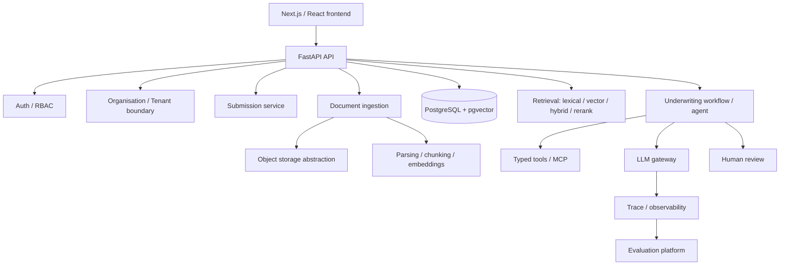

# Architecture

Status labels used throughout this document and the README: **Implemented**,
**In progress**, **Planned**. Nothing below is marked Implemented until code
exists and has been run.

## System overview (target — Planned)

This is a **modular monolith**: one FastAPI application with clearly bounded
internal modules (`api/auth/core/db/models/schemas/repositories/services/
ingestion/retrieval/agents/tools/llm/evals/observability`), not separate
deployable services. Reconsider only if a concrete scaling or team boundary
forces it — not before.

---

## Decision: Repository layout

**Context.** Need a structure that scales through ~20 roadmap stages without
forcing premature service splits or empty placeholder packages.

**Options considered.**
- Single flat FastAPI app, no monorepo packages.
- Monorepo with `apps/api`, `apps/web`, and shared `packages/*`.
- Full microservices split per domain.

**Decision.** Monorepo: `apps/api` (FastAPI), `apps/web` (Next.js),
`packages/*` created only when a package has real shared consumers (e.g.
`agent_core`, `retrieval`, `llm_gateway` once both the API and eval/benchmark
tooling need to import them). `benchmarks/`, `infra/`, `docs/` at the root.

**Why.** Matches the target directory layout in the project brief, keeps
backend/frontend independently testable/deployable, and avoids microservice
operational overhead this project doesn't need.

**Consequences.** `packages/*` will start mostly empty and fill in from
Stage 9 onward (structured extraction) and Stage 11 (retrieval benchmark) —
we will not scaffold empty packages ahead of a real consumer.

---

## Decision: Authentication approach

**Context.** Need to choose between HTTP-only cookie sessions, stateless
JWT, or an external auth provider (Auth0/Clerk/etc.), evaluated against this
project's actual deployment topology, not FastAPI defaults.

**Options considered.**

| Option | CSRF | XSS exposure | Revocation | Local dev | Operational complexity |
|---|---|---|---|---|---|
| Server-side sessions, HTTP-only cookie | Needs same-site/CSRF token | Low (token never in JS) | Immediate (delete session row) | Simple | Low |
| Stateless JWT (Authorization header) | Not applicable | Higher if stored in localStorage; lower via memory-only | Hard without a revocation list (defeats "stateless" benefit) | Simple | Low, but revocation adds a store anyway |
| External auth provider (Auth0/Clerk) | Handled by provider | Depends on integration | Provider-managed | Extra service dependency | Higher; another vendor to configure/demo |

**Decision.** Server-side sessions via HTTP-only, `Secure`, `SameSite=Lax`
cookies, backed by a `sessions` table in PostgreSQL (session id, user id,
issued/expires, revoked flag). CSRF protection via a double-submit token on
state-changing requests.

**Why.** Confirmed deployment topology: frontend and API are served under
the same origin (Next.js rewrites / shared reverse proxy in prod, same-origin
in local dev). Under same-origin, cookie sessions are the simplest option
that is secure by construction — no token ever touches JavaScript (mitigates
XSS token theft), revocation is a single-row update (unlike JWT, which needs
its own denylist to revoke — at which point it isn't meaningfully simpler
than sessions), and `SameSite=Lax` + a CSRF token on mutating requests fully
covers CSRF for this topology without cross-origin CORS complexity. An
external provider is not justified: it adds a vendor dependency and setup
friction for a portfolio project without solving a problem session auth
doesn't already solve here.

If a genuinely separate-origin deployment is introduced later (e.g. a
separately hosted marketing site), this decision should be revisited — that
is a materially different threat/ops profile and is explicitly out of scope
until it's real.

**Consequences.** Authentication (who you are) is implemented via session
cookie + `sessions` table. Authorization (what you can do) is a fully
separate server-side check (RBAC + tenant scoping) evaluated on every
request — a valid session never implies access to a given resource.

---

## Decision: Object storage abstraction

**Context.** Need to store original uploaded documents (PDFs, spreadsheets)
separately from relational metadata, without coupling ingestion code to one
cloud SDK.

**Decision (interface only at this stage).** A small `ObjectStorage`
interface — `put_object`, `get_object`, `delete_object`,
`generate_access_url` — with a filesystem-backed implementation for local
dev and an S3-compatible implementation for deployment. Concrete
implementation lands in Stage 4 (Upload/storage), not now.

**Why.** Keeps ingestion/service code storage-agnostic; swapping filesystem
for S3-compatible storage should only touch the implementation, never
callers. Avoids introducing MinIO/AWS SDK dependencies before there's a real
upload path to exercise them.

---

## Decision: Multi-tenant isolation strategy

**Context.** Cross-tenant data leakage is the single highest-severity risk
class in this system (documents may contain sensitive financial data).

**Decision.** Application-layer enforcement first: every repository method
that reads/writes tenant-owned rows requires an `organisation_id` derived
from the authenticated session's active membership — never from a request
body/query param. Service layer never accepts a bare resource ID without
also checking it resolves within the caller's organisation. Row-Level
Security (RLS) in PostgreSQL is a **candidate defense-in-depth layer**,
deferred until the application-layer boundary is implemented and tested
(explicitly flagged in the brief as "evaluate later, don't introduce
automatically").

**Why.** Application-layer checks are necessary regardless of RLS (RLS
alone doesn't stop business-logic bugs like leaking a cross-tenant ID in an
API response), and are simpler to write tests against first. RLS adds real
value as a second layer but also adds operational complexity (session
variables per connection, policy maintenance) that isn't justified until the
first layer is proven and there's a concrete incident class it would catch
that tests aren't already catching.

**Consequences.** Every new tenant-owned model/endpoint must ship with at
least one cross-tenant-denial test before being considered done (see
`CLAUDE.md` security rules).

---

## Decision: Background job execution

**Status.** Deferred — not decided yet. Per the brief, Celery/Redis must not
be introduced by default. When document ingestion or agent runs first need
to outlive a single HTTP request (Stage 5 onward), this section will compare
FastAPI `BackgroundTasks`, a DB-backed job table/worker, and Redis/RQ against
actual reliability/durability requirements at that point, and record the
decision here.

---

## Dependency decisions log

Recorded as they're actually added, with justification, per the dependency
policy in the brief.

**Stage 1 backend (`apps/api`):** FastAPI, Pydantic v2 + pydantic-settings,
SQLAlchemy 2.x (async) + asyncpg + greenlet (required by SQLAlchemy's async
engine — missing it fails connections at runtime, not at import time; caught
by manually exercising the health endpoint, not by the unit test suite,
since the test suite overrides the DB dependency), pytest + pytest-asyncio +
httpx (ASGI transport, no running server needed for tests), ruff, mypy
(`strict = true`). Alembic deliberately **not** added yet — no models exist
to migrate; it lands in Stage 2.

**Stage 1 frontend (`apps/web`):** Next.js 15 (App Router) + React 19 +
TypeScript, eslint (flat config via `eslint-config-next`). No UI component
library added yet — not justified by a single scaffold page.

**Stage 1 infra:** `pgvector/pgvector:pg16` Docker image for Postgres (ships
the pgvector extension pre-installed, avoiding a manual `CREATE EXTENSION`
step in an init script for something we need from Stage 6 onward anyway).

---

## Roadmap

Stage 0 (this document + `CLAUDE.md`) is in progress. Stages 1–21 as defined
in the project brief; each stage stops for explicit go-ahead before the next
begins. Not reproduced here in full to avoid drift — the authoritative stage
list is the one the user provided; this file records decisions made *within*
each stage as it happens, plus a status line per stage below.

| Stage | Name | Status |
|---|---|---|
| 0 | Architecture/bootstrap planning | Done |
| 1 | Development environment | In progress — backend verified locally (ruff/mypy/pytest all pass); frontend and Docker Compose stack written but not run (no Node/Docker in the authoring environment) |
| 2 | Core domain | Planned |
| 3 | Auth/RBAC | Planned |
| 4 | Upload/storage | Planned |
| 5 | Parsing/chunking | Planned |
| 6 | Embeddings/vector retrieval | Planned |
| 7 | Minimal frontend | Planned |
| 8 | First milestone hardening | Planned |
| 9–21 | Structured extraction → deployment/polish | Planned |
